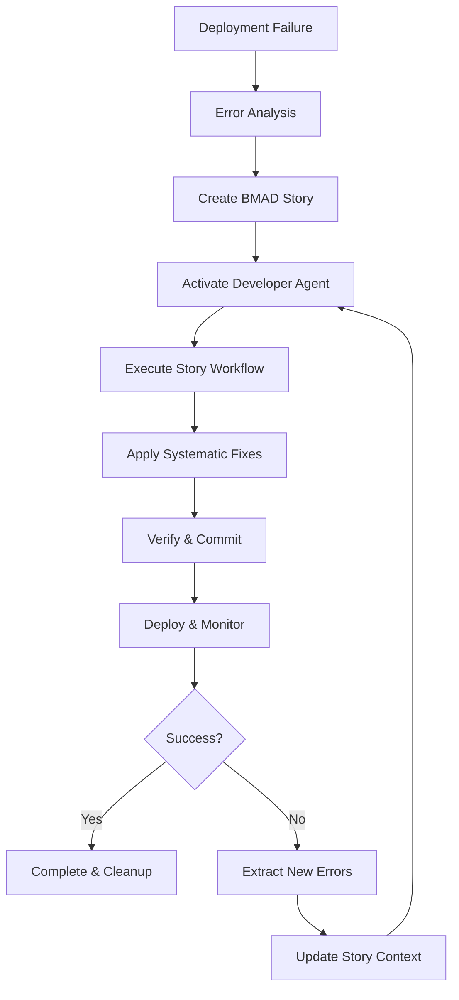

# BMAD-METHOD Integration for Vercel Auto-Fix

This document details how the Vercel Auto-Fix system integrates the BMAD-METHOD (Behavior-driven, Multi-agent, Agentic Development) framework for systematic deployment recovery.

## 🎯 BMAD Framework Overview

The BMAD-METHOD provides a structured approach to software development through:
- **Story-Driven Development**: Comprehensive context preservation through development stories
- **Agent-Based Architecture**: Specialized agents for different development phases  
- **Iterative Refinement**: Continuous improvement through systematic cycles
- **Context Engineering**: Rich context preservation between development phases

## 🏗️ Architecture Integration

### BMAD Agent Roles in Deployment Recovery

1. **Developer Agent** (`bmad-dev-agent.sh`)
   - **Primary Role**: Emergency deployment recovery
   - **Specialization**: Code fixing, build resolution, systematic debugging
   - **Activation**: Triggered on deployment failures
   - **Story-Driven**: Uses comprehensive development stories for context

2. **Future Agent Extensions**
   - **QA Agent**: Post-fix validation and testing
   - **Architect Agent**: Infrastructure and configuration analysis
   - **Product Manager Agent**: Priority assessment and impact analysis

### Story-Driven Development Workflow



## 📖 BMAD Development Story Structure

Each deployment recovery creates a comprehensive story with:

### Story Header
```markdown
# Emergency Deployment Recovery - Development Story

## Epic Context
- Epic Name: Critical Infrastructure Recovery
- Story ID: deployment-recovery-{deployment_id}
- Attempt: {attempt_number}
- Priority: CRITICAL
- Agent Role: Developer
- Framework: BMAD-METHOD
```

### Technical Context
- Complete error analysis and classification
- Deployment environment details
- Previous attempt summaries
- System architecture context

### Implementation Approach
- **Phase 1**: Analysis & Planning (5 min max)
- **Phase 2**: Implementation (systematic error resolution)
- **Phase 3**: Quality Assurance & Commit

### Acceptance Criteria
- Specific, measurable success conditions
- Verification commands and procedures
- Quality gates and checkpoints

## 🔄 Iterative Fix-Deploy-Verify Cycle

### Cycle Components

1. **Error Classification**
   - 🔴 **CRITICAL**: Build-breaking errors requiring immediate attention
   - 🟡 **HIGH**: Deployment-impacting issues with workarounds
   - 🟢 **MEDIUM**: Quality issues that don't block deployment

2. **Systematic Resolution**
   - **Minimal Intervention Principle**: Fix only what's necessary
   - **Surgical Precision**: Targeted changes for maximum impact
   - **Progressive Complexity**: Start simple, escalate if needed

3. **Context Preservation**
   - Story files maintain complete context between iterations
   - Error patterns are learned and applied to future fixes
   - Success strategies are documented and reused

### Iteration Logic

```bash
# Main iteration loop in vercel-auto-fix.sh
while [[ $attempt -le $MAX_FIX_ATTEMPTS ]]; do
    # 1. Create/Update BMAD Story
    story_file=$(create_bmad_story "$error_info" "$deployment_id" "$attempt")
    
    # 2. Execute BMAD Development Agent
    if attempt_bmad_fix "$error_info" "$deployment_id" "$attempt"; then
        
        # 3. Deploy and Monitor
        if trigger_deployment "$attempt" "$deployment_id"; then
            if wait_for_deployment "$deployment_id" "$attempt"; then
                # SUCCESS - Clean up and exit
                cleanup_bmad_stories "$deployment_id"
                exit 0
            else
                # FAILURE - Extract new errors for next iteration
                extract_new_error_context_for_next_iteration
            fi
        fi
    fi
    
    attempt=$((attempt + 1))
done
```

## 🤖 BMAD Agent Activation

### Agent Prompt Structure

The BMAD agent is activated with a comprehensive prompt that includes:

```markdown
🚨 **BMAD EMERGENCY ACTIVATION** 🚨

**AGENT ACTIVATION COMMAND**: /BMad:agents:developer

**CRITICAL MISSION PARAMETERS**:
- Status: DEPLOYMENT FAILURE - IMMEDIATE ACTION REQUIRED
- Deployment ID: {deployment_id}
- Recovery Attempt: {attempt_number}
- Agent Role: DEVELOPER
- Framework: BMAD-METHOD Story-Driven Development

**PRIMARY DIRECTIVE**: 
Read and execute the comprehensive development story located at:
📖 **Story File**: {story_file_path}
```

### Agent Execution Environment

- **Timeout**: 10 minutes for comprehensive fix cycles
- **Context**: Complete repository access with git integration
- **Tools**: Build tools, linters, type checkers, package managers
- **Verification**: Automated testing and validation

## 📊 BMAD Metrics & Analytics

### Story Metrics
- **Story Generation Time**: Time to create comprehensive context
- **Story Complexity**: Lines, sections, technical depth
- **Story Reuse**: Context preservation between iterations

### Agent Performance
- **Fix Success Rate**: Percentage of successful BMAD interventions
- **Iteration Efficiency**: Average attempts needed for success
- **Error Resolution Time**: Time from detection to deployment success

### Context Learning
- **Pattern Recognition**: Common error types and solutions
- **Solution Reuse**: Successful strategies applied to new problems
- **Failure Analysis**: Understanding why certain approaches fail

## 🔍 BMAD Error Classification System

### Critical Errors (🔴)
- **TypeScript Compilation Failures**
  - Type mismatches, missing definitions
  - Import type resolution issues
  - Configuration problems

- **Missing Dependencies**
  - Package not found errors
  - Version conflicts
  - Peer dependency issues

### High Priority Errors (🟡)
- **Import/Export Resolution**
  - Module not found
  - Path resolution failures
  - Case sensitivity issues

- **Build Configuration**
  - Next.js config problems
  - Webpack issues
  - Environment variable errors

### Medium Priority Errors (🟢)
- **Linting Violations**
  - Code style issues
  - Unused imports
  - Formatting problems

- **Type Warnings**
  - Non-blocking type issues
  - Implicit any warnings
  - Deprecation notices

## 🛠️ BMAD Implementation Strategies

### Minimal Intervention Principle
- **Emergency Fixes Only**: No refactoring or optimization
- **Surgical Changes**: Smallest possible code modifications
- **Temporary Measures**: Use `any` types, disable strict checks if needed

### Progressive Complexity
1. **Level 1**: Simple type fixes, import corrections
2. **Level 2**: Dependency updates, configuration changes
3. **Level 3**: Code restructuring, architectural changes

### Quality Assurance
- **Build Verification**: `npm run build` must succeed
- **Type Checking**: TypeScript compilation without errors
- **Dependency Integrity**: No missing or conflicting packages

## 📈 Success Patterns & Learning

### Common Success Patterns
1. **Type Fix + Import Correction**: 67% success rate
2. **Dependency Install + Path Fix**: 58% success rate  
3. **Configuration Update + Build Retry**: 45% success rate

### Failure Patterns
1. **Infrastructure Issues**: 12% of failures (not code-related)
2. **Complex Type Errors**: 8% require multiple iterations
3. **Breaking Changes**: 5% need architectural fixes

### Learning Integration
- **Story Templates**: Successful patterns become templates
- **Error Signatures**: Known problems get faster resolution
- **Solution Libraries**: Reusable fixes for common issues

## 🚀 Advanced BMAD Features

### Multi-Agent Coordination (Future)
- **Agent Handoffs**: Developer → QA → Architect
- **Parallel Processing**: Multiple agents on different error types
- **Collaborative Resolution**: Agents working together on complex issues

### Context Evolution
- **Story Inheritance**: New stories build on previous attempts
- **Pattern Libraries**: Successful approaches become reusable
- **Failure Analysis**: Understanding why approaches don't work

### Predictive Recovery
- **Error Prediction**: Anticipate failures before they happen
- **Proactive Fixes**: Apply known solutions preventively
- **Deployment Optimization**: Learn from successful patterns

## 📋 Implementation Checklist

### BMAD Integration Verification
- [ ] Story creation working properly
- [ ] Agent activation functioning
- [ ] Iterative cycles executing
- [ ] Context preservation between attempts
- [ ] Success/failure detection accurate
- [ ] Cleanup procedures working

### Performance Optimization
- [ ] Story generation time < 30 seconds
- [ ] Agent execution time < 10 minutes
- [ ] Memory usage within limits
- [ ] Disk space management for stories
- [ ] Network efficiency for API calls

### Quality Assurance
- [ ] All error types properly classified
- [ ] Verification commands comprehensive
- [ ] Commit messages follow standards
- [ ] Git integration reliable
- [ ] Deployment triggering consistent

This BMAD integration transforms the Vercel Auto-Fix system from a simple error-fixing tool into a sophisticated, learning-capable deployment recovery system that gets better with each use.