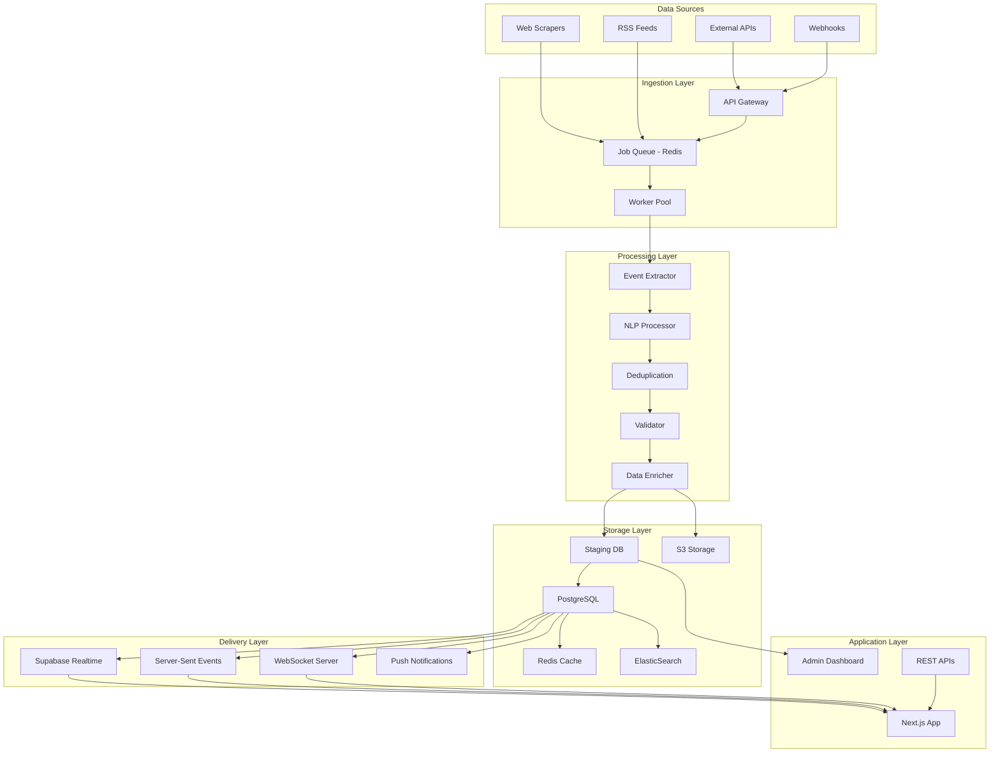

# Technical Architecture Plan: Dynamic Event Discovery & Real-Time Features
**Version:** 1.0  
**Date:** January 2025  
**Prepared for:** System Architect Review  
**Project:** Indiranagar Discovery Platform - Live Enhancement

## 1. System Architecture Overview

### 1.1 High-Level Architecture



### 1.2 Component Architecture

```yaml
System Components:
  Frontend:
    - Next.js 15 App Router (existing)
    - Real-time event subscribers
    - Progressive Web App features
    - Admin moderation interface
    
  Backend Services:
    Event Discovery Service:
      - Language: Node.js/TypeScript
      - Framework: NestJS
      - Purpose: Orchestrate data collection
      
    Scraping Service:
      - Language: Node.js
      - Tools: Puppeteer, Playwright
      - Purpose: Web data extraction
      
    NLP Service:
      - Language: Python
      - Framework: FastAPI
      - ML Libraries: spaCy, transformers
      - Purpose: Event extraction & categorization
      
    Notification Service:
      - Language: Node.js
      - Purpose: Multi-channel notifications
      
  Infrastructure:
    - Container Orchestration: Kubernetes
    - Message Queue: Redis + BullMQ
    - Caching: Redis
    - Search: ElasticSearch
    - Monitoring: Prometheus + Grafana
    - Logging: ELK Stack
```

## 2. Database Schema Design

### 2.1 Core Tables

```sql
-- Event source configuration
CREATE TABLE event_sources (
    id UUID PRIMARY KEY DEFAULT gen_random_uuid(),
    name VARCHAR(100) NOT NULL,
    type ENUM('api', 'scraper', 'rss', 'webhook') NOT NULL,
    config JSONB NOT NULL, -- API keys, endpoints, selectors
    is_active BOOLEAN DEFAULT true,
    rate_limit INTEGER DEFAULT 60, -- requests per hour
    last_fetched_at TIMESTAMPTZ,
    priority INTEGER DEFAULT 5,
    created_at TIMESTAMPTZ DEFAULT NOW(),
    updated_at TIMESTAMPTZ DEFAULT NOW()
);

-- Raw event data staging
CREATE TABLE events_staging (
    id UUID PRIMARY KEY DEFAULT gen_random_uuid(),
    source_id UUID REFERENCES event_sources(id),
    external_id VARCHAR(255),
    raw_data JSONB NOT NULL,
    processed_data JSONB,
    status ENUM('pending', 'processing', 'approved', 'rejected', 'duplicate') DEFAULT 'pending',
    duplicate_of UUID REFERENCES events_staging(id),
    confidence_score DECIMAL(3,2),
    extraction_metadata JSONB,
    created_at TIMESTAMPTZ DEFAULT NOW(),
    processed_at TIMESTAMPTZ,
    INDEX idx_staging_status (status),
    INDEX idx_staging_external (source_id, external_id)
);

-- Processed events (extends existing community_events)
CREATE TABLE discovered_events (
    id UUID PRIMARY KEY DEFAULT gen_random_uuid(),
    staging_id UUID REFERENCES events_staging(id),
    source_id UUID REFERENCES event_sources(id),
    
    -- Core event data
    title VARCHAR(255) NOT NULL,
    description TEXT,
    category VARCHAR(50),
    subcategory VARCHAR(50),
    tags TEXT[],
    
    -- Temporal data
    start_time TIMESTAMPTZ NOT NULL,
    end_time TIMESTAMPTZ,
    timezone VARCHAR(50) DEFAULT 'Asia/Kolkata',
    is_recurring BOOLEAN DEFAULT false,
    recurrence_rule JSONB,
    
    -- Location data
    venue_name VARCHAR(255),
    venue_address TEXT,
    latitude DECIMAL(10, 8),
    longitude DECIMAL(11, 8),
    plus_code VARCHAR(20),
    google_place_id VARCHAR(255),
    
    -- Organizer data
    organizer_name VARCHAR(255),
    organizer_type ENUM('business', 'individual', 'community', 'government'),
    contact_info JSONB,
    
    -- Metadata
    external_url TEXT,
    ticket_url TEXT,
    cost_type ENUM('free', 'paid', 'donation', 'variable'),
    price_range JSONB,
    capacity INTEGER,
    registration_required BOOLEAN DEFAULT false,
    
    -- Quality & moderation
    quality_score DECIMAL(3,2),
    verification_status ENUM('unverified', 'verified', 'official') DEFAULT 'unverified',
    moderation_status ENUM('pending', 'approved', 'rejected', 'flagged') DEFAULT 'pending',
    moderation_notes TEXT,
    moderated_by UUID,
    moderated_at TIMESTAMPTZ,
    
    -- Engagement metrics
    view_count INTEGER DEFAULT 0,
    rsvp_count INTEGER DEFAULT 0,
    share_count INTEGER DEFAULT 0,
    
    -- System fields
    is_active BOOLEAN DEFAULT true,
    created_at TIMESTAMPTZ DEFAULT NOW(),
    updated_at TIMESTAMPTZ DEFAULT NOW(),
    published_at TIMESTAMPTZ,
    
    INDEX idx_events_temporal (start_time, end_time),
    INDEX idx_events_geo (latitude, longitude),
    INDEX idx_events_category (category, subcategory),
    INDEX idx_events_status (moderation_status, is_active)
);

-- Event images
CREATE TABLE event_images (
    id UUID PRIMARY KEY DEFAULT gen_random_uuid(),
    event_id UUID REFERENCES discovered_events(id) ON DELETE CASCADE,
    url TEXT NOT NULL,
    thumbnail_url TEXT,
    source_url TEXT,
    alt_text TEXT,
    is_primary BOOLEAN DEFAULT false,
    created_at TIMESTAMPTZ DEFAULT NOW()
);

-- Deduplication tracking
CREATE TABLE event_duplicates (
    id UUID PRIMARY KEY DEFAULT gen_random_uuid(),
    primary_event_id UUID REFERENCES discovered_events(id),
    duplicate_event_id UUID REFERENCES events_staging(id),
    similarity_score DECIMAL(3,2),
    match_fields JSONB,
    created_at TIMESTAMPTZ DEFAULT NOW(),
    INDEX idx_duplicates_primary (primary_event_id)
);

-- Source fetch history
CREATE TABLE fetch_history (
    id UUID PRIMARY KEY DEFAULT gen_random_uuid(),
    source_id UUID REFERENCES event_sources(id),
    started_at TIMESTAMPTZ NOT NULL,
    completed_at TIMESTAMPTZ,
    status ENUM('success', 'partial', 'failed') NOT NULL,
    events_found INTEGER DEFAULT 0,
    events_processed INTEGER DEFAULT 0,
    events_approved INTEGER DEFAULT 0,
    error_details JSONB,
    execution_time_ms INTEGER,
    created_at TIMESTAMPTZ DEFAULT NOW()
);

-- Real-time place status
CREATE TABLE place_live_status (
    id UUID PRIMARY KEY DEFAULT gen_random_uuid(),
    place_id UUID REFERENCES places(id),
    is_open BOOLEAN,
    current_capacity ENUM('empty', 'quiet', 'moderate', 'busy', 'packed'),
    wait_time_minutes INTEGER,
    special_status TEXT, -- "Happy Hour", "Live Music", etc.
    source ENUM('google', 'user', 'prediction', 'business') DEFAULT 'prediction',
    confidence DECIMAL(3,2),
    valid_until TIMESTAMPTZ,
    created_at TIMESTAMPTZ DEFAULT NOW(),
    updated_at TIMESTAMPTZ DEFAULT NOW(),
    INDEX idx_place_status (place_id, valid_until)
);

-- User preferences for notifications
CREATE TABLE user_event_preferences (
    id UUID PRIMARY KEY DEFAULT gen_random_uuid(),
    user_id UUID NOT NULL,
    categories TEXT[],
    keywords TEXT[],
    preferred_days VARCHAR(10)[],
    preferred_times JSONB,
    max_distance_km INTEGER DEFAULT 5,
    price_range JSONB,
    notification_channels JSONB DEFAULT '{"push": true, "email": false}',
    created_at TIMESTAMPTZ DEFAULT NOW(),
    updated_at TIMESTAMPTZ DEFAULT NOW()
);
```

### 2.2 Database Indexes & Optimization

```sql
-- Performance indexes
CREATE INDEX idx_events_fulltext ON discovered_events 
USING gin(to_tsvector('english', title || ' ' || COALESCE(description, '')));

CREATE INDEX idx_events_date_range ON discovered_events (start_time, end_time)
WHERE is_active = true AND moderation_status = 'approved';

CREATE INDEX idx_events_geo_distance ON discovered_events 
USING gist(ll_to_earth(latitude, longitude));

-- Materialized view for trending events
CREATE MATERIALIZED VIEW trending_events AS
SELECT 
    e.*,
    (e.view_count * 0.3 + e.rsvp_count * 0.5 + e.share_count * 0.2) as popularity_score
FROM discovered_events e
WHERE 
    e.start_time > NOW() 
    AND e.start_time < NOW() + INTERVAL '7 days'
    AND e.moderation_status = 'approved'
    AND e.is_active = true
ORDER BY popularity_score DESC
LIMIT 100;

CREATE INDEX idx_trending_popularity ON trending_events(popularity_score);
```

## 3. API Integration Specifications

### 3.1 External API Integrations

```typescript
// API Integration Interfaces

interface EventSource {
  id: string;
  name: string;
  type: 'api' | 'scraper' | 'rss' | 'webhook';
  authenticate(): Promise<void>;
  fetchEvents(params: FetchParams): Promise<RawEvent[]>;
  transform(raw: RawEvent): StandardEvent;
  validateResponse(response: any): boolean;
}

// Facebook Events API
class FacebookEventsSource implements EventSource {
  private accessToken: string;
  private apiVersion = 'v17.0';
  
  config = {
    endpoint: 'https://graph.facebook.com',
    rateLimit: {
      requests: 200,
      window: 3600, // 1 hour
    },
    searchParams: {
      place: 'Indiranagar Bangalore',
      radius: 2000, // meters
      categories: ['FESTIVAL_EVENT', 'FITNESS_RECREATION', 'FOOD_BEVERAGE', 'SHOPPING'],
    }
  };
  
  async fetchEvents(params: FetchParams): Promise<RawEvent[]> {
    const url = `${this.config.endpoint}/${this.apiVersion}/search`;
    const response = await fetch(url, {
      method: 'GET',
      headers: {
        'Authorization': `Bearer ${this.accessToken}`,
      },
      params: {
        type: 'event',
        q: params.query || this.config.searchParams.place,
        center: `${params.lat},${params.lng}`,
        distance: this.config.searchParams.radius,
        fields: 'id,name,description,start_time,end_time,place,cover,attending_count',
        limit: 50,
      }
    });
    
    return this.parseResponse(response);
  }
}

// Google Places API
class GooglePlacesSource implements EventSource {
  private apiKey: string;
  
  config = {
    endpoint: 'https://maps.googleapis.com/maps/api/place',
    rateLimit: {
      requests: 100,
      window: 60, // 1 minute
    },
    searchRadius: 2000,
  };
  
  async fetchEvents(params: FetchParams): Promise<RawEvent[]> {
    // Fetch places with events
    const placesUrl = `${this.config.endpoint}/nearbysearch/json`;
    const placesResponse = await fetch(placesUrl, {
      params: {
        key: this.apiKey,
        location: `${params.lat},${params.lng}`,
        radius: this.config.searchRadius,
        type: 'restaurant|cafe|bar|night_club',
      }
    });
    
    const places = await placesResponse.json();
    const events: RawEvent[] = [];
    
    // Get details for each place including events
    for (const place of places.results) {
      const detailsUrl = `${this.config.endpoint}/details/json`;
      const details = await fetch(detailsUrl, {
        params: {
          key: this.apiKey,
          place_id: place.place_id,
          fields: 'editorial_summary,events,opening_hours,user_ratings_total',
        }
      });
      
      if (details.result.events) {
        events.push(...this.extractEvents(details.result));
      }
    }
    
    return events;
  }
}

// Eventbrite API
class EventbriteSource implements EventSource {
  private apiKey: string;
  
  config = {
    endpoint: 'https://www.eventbriteapi.com/v3',
    rateLimit: {
      requests: 1000,
      window: 3600,
    }
  };
  
  async fetchEvents(params: FetchParams): Promise<RawEvent[]> {
    const url = `${this.config.endpoint}/events/search/`;
    const response = await fetch(url, {
      headers: {
        'Authorization': `Bearer ${this.apiKey}`,
      },
      params: {
        'location.latitude': params.lat,
        'location.longitude': params.lng,
        'location.within': '2km',
        'expand': 'venue,organizer,category',
        'sort_by': 'date',
      }
    });
    
    return this.parseResponse(response);
  }
}

// Instagram Location API (via Basic Display)
class InstagramLocationSource implements EventSource {
  private accessToken: string;
  
  config = {
    endpoint: 'https://graph.instagram.com',
    locationIds: [
      '235439779', // Indiranagar
      '1023093501047692', // 100 Feet Road
    ],
    rateLimit: {
      requests: 240,
      window: 3600,
    }
  };
  
  async fetchEvents(params: FetchParams): Promise<RawEvent[]> {
    const events: RawEvent[] = [];
    
    for (const locationId of this.config.locationIds) {
      const url = `${this.config.endpoint}/${locationId}/media`;
      const response = await fetch(url, {
        headers: {
          'Authorization': `Bearer ${this.accessToken}`,
        },
        params: {
          fields: 'id,caption,media_type,media_url,timestamp,username',
        }
      });
      
      const posts = await response.json();
      const extractedEvents = this.extractEventsFromPosts(posts.data);
      events.push(...extractedEvents);
    }
    
    return events;
  }
  
  private extractEventsFromPosts(posts: any[]): RawEvent[] {
    // Use NLP to extract event information from captions
    return posts
      .filter(post => this.isEventPost(post.caption))
      .map(post => this.extractEventDetails(post));
  }
}
```

### 3.2 Web Scraping Specifications

```typescript
// Scraping Configuration

interface ScraperConfig {
  url: string;
  selectors: {
    eventContainer: string;
    title: string;
    date: string;
    location: string;
    description?: string;
    image?: string;
    link?: string;
  };
  pagination?: {
    type: 'click' | 'scroll' | 'numbered';
    selector?: string;
    maxPages?: number;
  };
  authentication?: {
    type: 'none' | 'basic' | 'form' | 'oauth';
    credentials?: any;
  };
}

// BookMyShow Scraper
const bookmyshowConfig: ScraperConfig = {
  url: 'https://in.bookmyshow.com/bangalore/events',
  selectors: {
    eventContainer: '[data-testid="event-card"]',
    title: '.event-title',
    date: '.event-date',
    location: '.event-venue',
    description: '.event-description',
    image: '.event-image img',
    link: 'a.event-link',
  },
  pagination: {
    type: 'scroll',
    maxPages: 5,
  }
};

// LBB (Little Black Book) Scraper
const lbbConfig: ScraperConfig = {
  url: 'https://lbb.in/bangalore/category/events/',
  selectors: {
    eventContainer: '.card-event',
    title: 'h3.card-title',
    date: '.event-datetime',
    location: '.venue-name',
    description: '.card-description',
    image: '.card-image img',
    link: 'a.card-link',
  },
  pagination: {
    type: 'click',
    selector: '.pagination-next',
    maxPages: 10,
  }
};

// Scraping Service Implementation
class ScrapingService {
  private browser: Browser;
  private proxyPool: string[];
  
  async scrapeEvents(config: ScraperConfig): Promise<RawEvent[]> {
    const page = await this.browser.newPage();
    
    // Set random proxy
    await page.authenticate({
      username: process.env.PROXY_USERNAME,
      password: process.env.PROXY_PASSWORD,
    });
    
    // Navigate and wait for content
    await page.goto(config.url, { waitUntil: 'networkidle2' });
    
    // Handle authentication if needed
    if (config.authentication?.type === 'form') {
      await this.handleFormAuth(page, config.authentication);
    }
    
    const events: RawEvent[] = [];
    let currentPage = 1;
    
    do {
      // Extract events from current page
      const pageEvents = await page.evaluate((selectors) => {
        const containers = document.querySelectorAll(selectors.eventContainer);
        return Array.from(containers).map(container => ({
          title: container.querySelector(selectors.title)?.textContent,
          date: container.querySelector(selectors.date)?.textContent,
          location: container.querySelector(selectors.location)?.textContent,
          description: container.querySelector(selectors.description)?.textContent,
          image: container.querySelector(selectors.image)?.src,
          link: container.querySelector(selectors.link)?.href,
        }));
      }, config.selectors);
      
      events.push(...pageEvents);
      
      // Handle pagination
      if (config.pagination && currentPage < (config.pagination.maxPages || 10)) {
        const hasMore = await this.handlePagination(page, config.pagination);
        if (!hasMore) break;
        currentPage++;
      } else {
        break;
      }
    } while (true);
    
    await page.close();
    return events;
  }
}
```

## 4. Data Processing Pipeline

### 4.1 Event Processing Flow

```typescript
// Processing Pipeline Components

class EventProcessingPipeline {
  async process(rawEvent: RawEvent): Promise<ProcessedEvent> {
    // Step 1: Data Extraction
    const extracted = await this.extractionService.extract(rawEvent);
    
    // Step 2: NLP Processing
    const categorized = await this.nlpService.categorize(extracted);
    
    // Step 3: Geocoding
    const geocoded = await this.geocodingService.geocode(categorized);
    
    // Step 4: Deduplication
    const isDuplicate = await this.deduplicationService.check(geocoded);
    if (isDuplicate) {
      return { ...geocoded, status: 'duplicate', duplicateOf: isDuplicate.id };
    }
    
    // Step 5: Enrichment
    const enriched = await this.enrichmentService.enrich(geocoded);
    
    // Step 6: Quality Scoring
    const scored = await this.qualityService.score(enriched);
    
    // Step 7: Validation
    const validated = await this.validationService.validate(scored);
    
    return validated;
  }
}

// NLP Service for Event Extraction
class NLPService {
  private model: any; // Hugging Face transformer model
  
  async extractEventInfo(text: string): Promise<EventInfo> {
    const prompt = `Extract event information from the following text:
    Text: ${text}
    
    Extract:
    - Event name
    - Date and time
    - Location
    - Category
    - Price (if mentioned)
    - Description
    `;
    
    const response = await this.model.generate(prompt);
    return this.parseModelResponse(response);
  }
  
  async categorize(event: ExtractedEvent): Promise<CategorizedEvent> {
    const categories = [
      'food_festival', 'market', 'cultural_event', 
      'music', 'sports', 'workshop', 'meetup'
    ];
    
    const embedding = await this.model.encode(event.description);
    const categoryScores = await this.model.classify(embedding, categories);
    
    return {
      ...event,
      category: categoryScores[0].label,
      categoryConfidence: categoryScores[0].score,
      tags: this.extractTags(event.description),
    };
  }
}

// Deduplication Service
class DeduplicationService {
  async check(event: ProcessedEvent): Promise<DuplicateResult | null> {
    // Step 1: Exact match on external ID
    const exactMatch = await this.checkExactMatch(event);
    if (exactMatch) return exactMatch;
    
    // Step 2: Fuzzy matching on title + date + location
    const fuzzyMatches = await this.findSimilarEvents(event);
    
    for (const candidate of fuzzyMatches) {
      const similarity = this.calculateSimilarity(event, candidate);
      if (similarity > 0.85) {
        return {
          isDuplicate: true,
          id: candidate.id,
          similarity,
          matchedFields: ['title', 'date', 'location'],
        };
      }
    }
    
    return null;
  }
  
  private calculateSimilarity(event1: ProcessedEvent, event2: ProcessedEvent): number {
    const titleSim = this.stringSimilarity(event1.title, event2.title);
    const timeSim = this.timeSimilarity(event1.startTime, event2.startTime);
    const locationSim = this.locationSimilarity(
      { lat: event1.latitude, lng: event1.longitude },
      { lat: event2.latitude, lng: event2.longitude }
    );
    
    return (titleSim * 0.4 + timeSim * 0.3 + locationSim * 0.3);
  }
}
```

## 5. Real-Time Infrastructure

### 5.1 WebSocket & SSE Implementation

```typescript
// Real-time Event Broadcasting

class RealtimeEventService {
  private io: Server;
  private connections: Map<string, Socket>;
  
  constructor() {
    this.io = new Server({
      cors: {
        origin: process.env.FRONTEND_URL,
        credentials: true,
      },
      transports: ['websocket', 'polling'],
    });
    
    this.setupHandlers();
  }
  
  private setupHandlers() {
    this.io.on('connection', (socket) => {
      // Subscribe to event categories
      socket.on('subscribe:events', (params: SubscribeParams) => {
        const rooms = this.getRoomsForParams(params);
        rooms.forEach(room => socket.join(room));
      });
      
      // Subscribe to place updates
      socket.on('subscribe:places', (placeIds: string[]) => {
        placeIds.forEach(id => socket.join(`place:${id}`));
      });
      
      // Subscribe to weather updates
      socket.on('subscribe:weather', () => {
        socket.join('weather:indiranagar');
      });
    });
  }
  
  // Broadcast new event
  async broadcastNewEvent(event: ProcessedEvent) {
    const rooms = [
      'events:all',
      `events:${event.category}`,
      `events:area:${this.getAreaCode(event.latitude, event.longitude)}`,
    ];
    
    rooms.forEach(room => {
      this.io.to(room).emit('event:new', {
        id: event.id,
        title: event.title,
        category: event.category,
        startTime: event.startTime,
        location: event.venue_name,
      });
    });
  }
  
  // Broadcast place status update
  async broadcastPlaceStatus(placeId: string, status: PlaceStatus) {
    this.io.to(`place:${placeId}`).emit('place:status', {
      placeId,
      isOpen: status.isOpen,
      capacity: status.currentCapacity,
      specialStatus: status.specialStatus,
    });
  }
}

// Server-Sent Events for Weather
class WeatherSSEService {
  private clients: Map<string, Response>;
  
  async handleSSE(req: Request, res: Response) {
    res.writeHead(200, {
      'Content-Type': 'text/event-stream',
      'Cache-Control': 'no-cache',
      'Connection': 'keep-alive',
    });
    
    const clientId = uuid();
    this.clients.set(clientId, res);
    
    // Send initial weather
    const weather = await this.getLatestWeather();
    this.sendToClient(clientId, 'weather:update', weather);
    
    // Setup periodic updates
    const interval = setInterval(async () => {
      const update = await this.getLatestWeather();
      this.sendToClient(clientId, 'weather:update', update);
    }, 300000); // 5 minutes
    
    req.on('close', () => {
      clearInterval(interval);
      this.clients.delete(clientId);
    });
  }
  
  private sendToClient(clientId: string, event: string, data: any) {
    const client = this.clients.get(clientId);
    if (client) {
      client.write(`event: ${event}\n`);
      client.write(`data: ${JSON.stringify(data)}\n\n`);
    }
  }
}
```

## 6. Job Queue & Background Processing

### 6.1 Queue Configuration

```typescript
// BullMQ Job Queue Setup

import { Queue, Worker, QueueScheduler } from 'bullmq';

// Queue definitions
const queues = {
  eventFetch: new Queue('event-fetch', { connection: redisConfig }),
  eventProcess: new Queue('event-process', { connection: redisConfig }),
  notification: new Queue('notification', { connection: redisConfig }),
  enrichment: new Queue('enrichment', { connection: redisConfig }),
};

// Scheduled Jobs
class JobScheduler {
  async initialize() {
    // Schedule API fetches
    await queues.eventFetch.add(
      'facebook-events',
      { source: 'facebook' },
      { repeat: { cron: '*/30 * * * *' } } // Every 30 minutes
    );
    
    await queues.eventFetch.add(
      'google-places',
      { source: 'google' },
      { repeat: { cron: '0 */2 * * *' } } // Every 2 hours
    );
    
    await queues.eventFetch.add(
      'eventbrite',
      { source: 'eventbrite' },
      { repeat: { cron: '0 */1 * * *' } } // Every hour
    );
    
    // Schedule scrapers
    await queues.eventFetch.add(
      'bookmyshow-scraper',
      { source: 'bookmyshow', type: 'scraper' },
      { repeat: { cron: '0 */4 * * *' } } // Every 4 hours
    );
    
    // Schedule place status updates
    await queues.eventFetch.add(
      'place-status',
      { type: 'place-status' },
      { repeat: { cron: '*/15 * * * *' } } // Every 15 minutes
    );
  }
}

// Worker implementation
const eventFetchWorker = new Worker(
  'event-fetch',
  async (job) => {
    const { source, type } = job.data;
    
    try {
      let events: RawEvent[] = [];
      
      if (type === 'scraper') {
        const scraper = scraperFactory.create(source);
        events = await scraper.scrape();
      } else {
        const api = apiFactory.create(source);
        events = await api.fetchEvents();
      }
      
      // Queue events for processing
      for (const event of events) {
        await queues.eventProcess.add('process-event', {
          source,
          rawEvent: event,
        });
      }
      
      // Log fetch history
      await logFetchHistory(source, events.length, 'success');
      
      return { eventsFound: events.length };
    } catch (error) {
      await logFetchHistory(source, 0, 'failed', error);
      throw error;
    }
  },
  {
    connection: redisConfig,
    concurrency: 5,
  }
);
```

## 7. Monitoring & Observability

### 7.1 Metrics & Logging

```typescript
// Monitoring Setup

class MetricsCollector {
  private prometheus = new PrometheusClient();
  
  metrics = {
    eventsDiscovered: new Counter({
      name: 'events_discovered_total',
      help: 'Total events discovered',
      labelNames: ['source', 'category'],
    }),
    
    processingDuration: new Histogram({
      name: 'event_processing_duration_seconds',
      help: 'Event processing duration',
      labelNames: ['stage'],
    }),
    
    apiLatency: new Histogram({
      name: 'api_latency_seconds',
      help: 'External API latency',
      labelNames: ['api', 'endpoint'],
    }),
    
    duplicateRate: new Gauge({
      name: 'duplicate_rate',
      help: 'Rate of duplicate events',
      labelNames: ['source'],
    }),
    
    activeConnections: new Gauge({
      name: 'websocket_connections',
      help: 'Active WebSocket connections',
    }),
  };
  
  async recordEventDiscovered(source: string, category: string) {
    this.metrics.eventsDiscovered.labels(source, category).inc();
  }
  
  async recordProcessingTime(stage: string, duration: number) {
    this.metrics.processingDuration.labels(stage).observe(duration);
  }
}

// Logging configuration
const logger = winston.createLogger({
  level: 'info',
  format: winston.format.json(),
  transports: [
    new winston.transports.File({ filename: 'error.log', level: 'error' }),
    new winston.transports.File({ filename: 'combined.log' }),
    new ElasticsearchTransport({
      level: 'info',
      clientOpts: { node: process.env.ELASTICSEARCH_URL },
      index: 'event-discovery',
    }),
  ],
});

// Distributed tracing
import { trace } from '@opentelemetry/api';

const tracer = trace.getTracer('event-discovery-service');

async function processEventWithTracing(event: RawEvent) {
  const span = tracer.startSpan('process-event');
  
  try {
    span.setAttributes({
      'event.source': event.source,
      'event.id': event.id,
    });
    
    const result = await eventProcessor.process(event);
    span.setStatus({ code: SpanStatusCode.OK });
    return result;
  } catch (error) {
    span.recordException(error);
    span.setStatus({ code: SpanStatusCode.ERROR });
    throw error;
  } finally {
    span.end();
  }
}
```

## 8. Security & Compliance

### 8.1 Security Measures

```typescript
// Security Implementation

class SecurityService {
  // API Key rotation
  async rotateApiKeys() {
    const sources = await db.eventSources.findAll();
    
    for (const source of sources) {
      if (this.shouldRotateKey(source)) {
        const newKey = await this.generateNewKey(source);
        await this.updateSourceConfig(source.id, { apiKey: newKey });
        await this.notifyKeyRotation(source);
      }
    }
  }
  
  // Rate limiting per source
  async checkRateLimit(source: string): Promise<boolean> {
    const key = `ratelimit:${source}`;
    const current = await redis.incr(key);
    
    if (current === 1) {
      await redis.expire(key, 3600); // 1 hour window
    }
    
    const limit = this.getRateLimitForSource(source);
    return current <= limit;
  }
  
  // Input sanitization
  sanitizeEventData(event: RawEvent): SanitizedEvent {
    return {
      ...event,
      title: DOMPurify.sanitize(event.title),
      description: DOMPurify.sanitize(event.description, {
        ALLOWED_TAGS: ['b', 'i', 'em', 'strong', 'a'],
        ALLOWED_ATTR: ['href'],
      }),
      // Remove PII
      organizer_email: this.hashEmail(event.organizer_email),
      organizer_phone: null,
    };
  }
  
  // Content moderation
  async moderateContent(event: ProcessedEvent): Promise<ModerationResult> {
    const checks = await Promise.all([
      this.checkProfanity(event),
      this.checkSpam(event),
      this.checkMaliciousLinks(event),
      this.checkCopyright(event),
    ]);
    
    return {
      approved: checks.every(c => c.passed),
      flags: checks.filter(c => !c.passed).map(c => c.reason),
    };
  }
}

// Data privacy compliance
class PrivacyCompliance {
  // GDPR compliance
  async anonymizeOldEvents() {
    const cutoffDate = new Date();
    cutoffDate.setMonth(cutoffDate.getMonth() - 6);
    
    await db.discoveredEvents.update(
      {
        organizer_email: null,
        organizer_phone: null,
        contact_info: null,
      },
      {
        where: {
          created_at: { [Op.lt]: cutoffDate },
        },
      }
    );
  }
  
  // Data retention policy
  async enforceRetentionPolicy() {
    // Delete staging data older than 30 days
    await db.eventsStaging.destroy({
      where: {
        created_at: { [Op.lt]: new Date(Date.now() - 30 * 24 * 60 * 60 * 1000) },
      },
    });
    
    // Archive old events
    const archiveCutoff = new Date();
    archiveCutoff.setFullYear(archiveCutoff.getFullYear() - 1);
    
    const oldEvents = await db.discoveredEvents.findAll({
      where: {
        end_time: { [Op.lt]: archiveCutoff },
      },
    });
    
    await this.archiveEvents(oldEvents);
  }
}
```

## 9. Deployment Architecture

### 9.1 Kubernetes Configuration

```yaml
# Kubernetes Deployment Manifests

apiVersion: apps/v1
kind: Deployment
metadata:
  name: event-discovery-api
spec:
  replicas: 3
  selector:
    matchLabels:
      app: event-discovery-api
  template:
    metadata:
      labels:
        app: event-discovery-api
    spec:
      containers:
      - name: api
        image: event-discovery-api:latest
        ports:
        - containerPort: 3000
        env:
        - name: NODE_ENV
          value: "production"
        - name: DATABASE_URL
          valueFrom:
            secretKeyRef:
              name: db-secret
              key: url
        - name: REDIS_URL
          valueFrom:
            secretKeyRef:
              name: redis-secret
              key: url
        resources:
          requests:
            memory: "256Mi"
            cpu: "250m"
          limits:
            memory: "512Mi"
            cpu: "500m"
        livenessProbe:
          httpGet:
            path: /health
            port: 3000
          initialDelaySeconds: 30
          periodSeconds: 10

---
apiVersion: apps/v1
kind: Deployment
metadata:
  name: event-processor
spec:
  replicas: 5
  selector:
    matchLabels:
      app: event-processor
  template:
    metadata:
      labels:
        app: event-processor
    spec:
      containers:
      - name: processor
        image: event-processor:latest
        env:
        - name: WORKER_TYPE
          value: "processor"
        - name: CONCURRENCY
          value: "10"
        resources:
          requests:
            memory: "512Mi"
            cpu: "500m"
          limits:
            memory: "1Gi"
            cpu: "1000m"

---
apiVersion: apps/v1
kind: Deployment
metadata:
  name: scraper-workers
spec:
  replicas: 3
  selector:
    matchLabels:
      app: scraper-workers
  template:
    metadata:
      labels:
        app: scraper-workers
    spec:
      containers:
      - name: scraper
        image: scraper-worker:latest
        env:
        - name: WORKER_TYPE
          value: "scraper"
        - name: HEADLESS
          value: "true"
        - name: PROXY_ENABLED
          value: "true"
        resources:
          requests:
            memory: "1Gi"
            cpu: "1000m"
          limits:
            memory: "2Gi"
            cpu: "2000m"

---
apiVersion: v1
kind: Service
metadata:
  name: event-discovery-api
spec:
  selector:
    app: event-discovery-api
  ports:
  - port: 80
    targetPort: 3000
  type: LoadBalancer

---
apiVersion: autoscaling/v2
kind: HorizontalPodAutoscaler
metadata:
  name: api-hpa
spec:
  scaleTargetRef:
    apiVersion: apps/v1
    kind: Deployment
    name: event-discovery-api
  minReplicas: 3
  maxReplicas: 10
  metrics:
  - type: Resource
    resource:
      name: cpu
      target:
        type: Utilization
        averageUtilization: 70
  - type: Resource
    resource:
      name: memory
      target:
        type: Utilization
        averageUtilization: 80
```

### 9.2 Infrastructure as Code

```terraform
# Terraform Infrastructure Configuration

provider "aws" {
  region = "ap-south-1" # Mumbai region for low latency to Bangalore
}

# RDS PostgreSQL for main database
resource "aws_db_instance" "events_db" {
  identifier             = "events-discovery-db"
  engine                 = "postgres"
  engine_version         = "14.7"
  instance_class         = "db.r6g.xlarge"
  allocated_storage      = 100
  storage_encrypted      = true
  storage_type           = "gp3"
  
  db_name  = "events"
  username = var.db_username
  password = var.db_password
  
  vpc_security_group_ids = [aws_security_group.db.id]
  db_subnet_group_name   = aws_db_subnet_group.main.name
  
  backup_retention_period = 30
  backup_window          = "03:00-04:00"
  maintenance_window     = "sun:04:00-sun:05:00"
  
  enabled_cloudwatch_logs_exports = ["postgresql"]
  
  tags = {
    Name        = "events-discovery-db"
    Environment = "production"
  }
}

# ElastiCache Redis cluster
resource "aws_elasticache_replication_group" "redis" {
  replication_group_id       = "events-cache"
  replication_group_description = "Redis cluster for events caching and queues"
  
  engine               = "redis"
  engine_version       = "7.0"
  node_type            = "cache.r6g.large"
  number_cache_clusters = 3
  
  automatic_failover_enabled = true
  multi_az_enabled          = true
  
  at_rest_encryption_enabled = true
  transit_encryption_enabled = true
  
  subnet_group_name = aws_elasticache_subnet_group.main.name
  security_group_ids = [aws_security_group.redis.id]
  
  snapshot_retention_limit = 7
  snapshot_window         = "03:00-05:00"
  
  tags = {
    Name        = "events-cache"
    Environment = "production"
  }
}

# S3 bucket for event images
resource "aws_s3_bucket" "event_images" {
  bucket = "indiranagar-event-images"
  
  tags = {
    Name        = "event-images"
    Environment = "production"
  }
}

resource "aws_s3_bucket_versioning" "event_images" {
  bucket = aws_s3_bucket.event_images.id
  
  versioning_configuration {
    status = "Enabled"
  }
}

resource "aws_s3_bucket_lifecycle_configuration" "event_images" {
  bucket = aws_s3_bucket.event_images.id
  
  rule {
    id     = "delete-old-versions"
    status = "Enabled"
    
    noncurrent_version_expiration {
      noncurrent_days = 30
    }
  }
  
  rule {
    id     = "intelligent-tiering"
    status = "Enabled"
    
    transition {
      days          = 30
      storage_class = "INTELLIGENT_TIERING"
    }
  }
}

# CloudFront CDN
resource "aws_cloudfront_distribution" "cdn" {
  enabled             = true
  is_ipv6_enabled     = true
  default_root_object = "index.html"
  
  origin {
    domain_name = aws_s3_bucket.event_images.bucket_regional_domain_name
    origin_id   = "S3-event-images"
    
    s3_origin_config {
      origin_access_identity = aws_cloudfront_origin_access_identity.oai.cloudfront_access_identity_path
    }
  }
  
  default_cache_behavior {
    allowed_methods  = ["GET", "HEAD", "OPTIONS"]
    cached_methods   = ["GET", "HEAD"]
    target_origin_id = "S3-event-images"
    
    forwarded_values {
      query_string = false
      cookies {
        forward = "none"
      }
    }
    
    viewer_protocol_policy = "redirect-to-https"
    min_ttl                = 0
    default_ttl            = 86400
    max_ttl                = 31536000
  }
  
  price_class = "PriceClass_200"
  
  restrictions {
    geo_restriction {
      restriction_type = "none"
    }
  }
  
  viewer_certificate {
    cloudfront_default_certificate = true
  }
  
  tags = {
    Name        = "events-cdn"
    Environment = "production"
  }
}
```

## 10. Performance Optimization

### 10.1 Caching Strategy

```typescript
// Multi-layer Caching Implementation

class CacheManager {
  private l1Cache: NodeCache; // In-memory cache
  private l2Cache: Redis;      // Redis cache
  private l3Cache: CDN;        // CloudFront CDN
  
  async get(key: string): Promise<any> {
    // Check L1 (memory)
    const l1Result = this.l1Cache.get(key);
    if (l1Result) return l1Result;
    
    // Check L2 (Redis)
    const l2Result = await this.l2Cache.get(key);
    if (l2Result) {
      this.l1Cache.set(key, l2Result, 60); // Cache for 1 minute
      return l2Result;
    }
    
    // Check L3 (CDN) for static content
    if (this.isStaticContent(key)) {
      const l3Result = await this.l3Cache.get(key);
      if (l3Result) {
        await this.l2Cache.setex(key, 300, l3Result); // 5 minutes
        this.l1Cache.set(key, l3Result, 60);
        return l3Result;
      }
    }
    
    return null;
  }
  
  async set(key: string, value: any, ttl: number = 300) {
    // Set in all layers with appropriate TTLs
    this.l1Cache.set(key, value, Math.min(ttl, 60));
    await this.l2Cache.setex(key, ttl, JSON.stringify(value));
    
    if (this.isStaticContent(key)) {
      await this.l3Cache.put(key, value, ttl * 10); // 10x TTL for CDN
    }
  }
  
  // Cache invalidation
  async invalidate(pattern: string) {
    // Clear L1
    const l1Keys = this.l1Cache.keys();
    l1Keys.filter(k => k.match(pattern)).forEach(k => this.l1Cache.del(k));
    
    // Clear L2
    const l2Keys = await this.l2Cache.keys(pattern);
    if (l2Keys.length > 0) {
      await this.l2Cache.del(...l2Keys);
    }
    
    // Invalidate CDN
    await this.l3Cache.createInvalidation({
      Paths: {
        Quantity: 1,
        Items: [`/${pattern}*`],
      },
    });
  }
}

// Query optimization
class OptimizedEventQueries {
  async getUpcomingEvents(params: QueryParams): Promise<Event[]> {
    const cacheKey = `events:upcoming:${JSON.stringify(params)}`;
    
    // Try cache first
    const cached = await cacheManager.get(cacheKey);
    if (cached) return cached;
    
    // Use optimized query with proper indexes
    const query = `
      SELECT 
        e.*,
        ei.url as primary_image,
        COUNT(DISTINCT er.id) as rsvp_count,
        AVG(r.rating) as avg_rating
      FROM discovered_events e
      LEFT JOIN event_images ei ON ei.event_id = e.id AND ei.is_primary = true
      LEFT JOIN event_rsvps er ON er.event_id = e.id
      LEFT JOIN event_ratings r ON r.event_id = e.id
      WHERE 
        e.start_time > NOW()
        AND e.start_time < NOW() + INTERVAL '7 days'
        AND e.moderation_status = 'approved'
        AND e.is_active = true
        ${params.category ? "AND e.category = :category" : ""}
        ${params.lat && params.lng ? `
          AND earth_distance(
            ll_to_earth(e.latitude, e.longitude),
            ll_to_earth(:lat, :lng)
          ) < :radius * 1000
        ` : ""}
      GROUP BY e.id, ei.url
      ORDER BY e.start_time ASC
      LIMIT :limit OFFSET :offset
    `;
    
    const events = await db.query(query, {
      replacements: {
        category: params.category,
        lat: params.lat,
        lng: params.lng,
        radius: params.radius || 2,
        limit: params.limit || 20,
        offset: params.offset || 0,
      },
      type: QueryTypes.SELECT,
    });
    
    // Cache results
    await cacheManager.set(cacheKey, events, 300); // 5 minutes
    
    return events;
  }
}
```

## 11. Testing Strategy

### 11.1 Test Specifications

```typescript
// Testing Framework

describe('Event Discovery System', () => {
  describe('API Integration Tests', () => {
    it('should fetch events from Facebook API', async () => {
      const source = new FacebookEventsSource();
      const events = await source.fetchEvents({
        lat: 12.9716,
        lng: 77.5946,
      });
      
      expect(events).toBeDefined();
      expect(events.length).toBeGreaterThan(0);
      expect(events[0]).toHaveProperty('title');
      expect(events[0]).toHaveProperty('start_time');
    });
    
    it('should handle API rate limits gracefully', async () => {
      const source = new EventbriteSource();
      const promises = Array(100).fill(null).map(() => 
        source.fetchEvents({ lat: 12.9716, lng: 77.5946 })
      );
      
      await expect(Promise.all(promises)).rejects.toThrow('Rate limit');
    });
  });
  
  describe('Deduplication Tests', () => {
    it('should detect exact duplicates', async () => {
      const dedup = new DeduplicationService();
      const event1 = createMockEvent({ external_id: 'fb_123' });
      const event2 = createMockEvent({ external_id: 'fb_123' });
      
      await dedup.store(event1);
      const result = await dedup.check(event2);
      
      expect(result.isDuplicate).toBe(true);
      expect(result.similarity).toBe(1.0);
    });
    
    it('should detect fuzzy duplicates', async () => {
      const dedup = new DeduplicationService();
      const event1 = createMockEvent({
        title: 'Food Festival at Indiranagar',
        start_time: '2024-02-15T18:00:00Z',
      });
      const event2 = createMockEvent({
        title: 'Indiranagar Food Festival',
        start_time: '2024-02-15T18:30:00Z',
      });
      
      await dedup.store(event1);
      const result = await dedup.check(event2);
      
      expect(result.isDuplicate).toBe(true);
      expect(result.similarity).toBeGreaterThan(0.85);
    });
  });
  
  describe('Load Tests', () => {
    it('should handle 1000 concurrent event processing', async () => {
      const events = Array(1000).fill(null).map(() => createMockEvent());
      const startTime = Date.now();
      
      await Promise.all(events.map(e => eventProcessor.process(e)));
      
      const duration = Date.now() - startTime;
      expect(duration).toBeLessThan(60000); // Under 1 minute
    });
  });
});

// E2E Tests
describe('E2E Event Discovery Flow', () => {
  it('should discover, process, and display new event', async () => {
    // 1. Trigger event discovery
    await request(app)
      .post('/api/admin/trigger-fetch')
      .send({ source: 'eventbrite' })
      .expect(200);
    
    // 2. Wait for processing
    await waitFor(async () => {
      const staging = await db.eventsStaging.findOne({
        where: { source_id: 'eventbrite', status: 'approved' },
      });
      expect(staging).toBeDefined();
    });
    
    // 3. Check if event appears in API
    const response = await request(app)
      .get('/api/events')
      .expect(200);
    
    expect(response.body.events).toHaveLength(greaterThan(0));
    
    // 4. Verify WebSocket broadcast
    const wsClient = new WebSocketClient();
    await wsClient.connect();
    
    const message = await wsClient.waitForMessage('event:new');
    expect(message).toHaveProperty('id');
    expect(message).toHaveProperty('title');
  });
});
```

## 12. Migration Strategy

### 12.1 Database Migrations

```sql
-- Migration: 001_create_event_discovery_tables.sql

BEGIN;

-- Create event sources table
CREATE TABLE IF NOT EXISTS event_sources (
    id UUID PRIMARY KEY DEFAULT gen_random_uuid(),
    name VARCHAR(100) NOT NULL,
    type VARCHAR(20) NOT NULL CHECK (type IN ('api', 'scraper', 'rss', 'webhook')),
    config JSONB NOT NULL,
    is_active BOOLEAN DEFAULT true,
    rate_limit INTEGER DEFAULT 60,
    last_fetched_at TIMESTAMPTZ,
    priority INTEGER DEFAULT 5,
    created_at TIMESTAMPTZ DEFAULT NOW(),
    updated_at TIMESTAMPTZ DEFAULT NOW()
);

-- Create staging table
CREATE TABLE IF NOT EXISTS events_staging (
    id UUID PRIMARY KEY DEFAULT gen_random_uuid(),
    source_id UUID REFERENCES event_sources(id),
    external_id VARCHAR(255),
    raw_data JSONB NOT NULL,
    processed_data JSONB,
    status VARCHAR(20) DEFAULT 'pending',
    duplicate_of UUID REFERENCES events_staging(id),
    confidence_score DECIMAL(3,2),
    extraction_metadata JSONB,
    created_at TIMESTAMPTZ DEFAULT NOW(),
    processed_at TIMESTAMPTZ
);

-- Add indexes
CREATE INDEX idx_staging_status ON events_staging(status);
CREATE INDEX idx_staging_external ON events_staging(source_id, external_id);
CREATE INDEX idx_staging_created ON events_staging(created_at);

-- Insert initial event sources
INSERT INTO event_sources (name, type, config, priority) VALUES
('Facebook Events', 'api', '{"endpoint": "https://graph.facebook.com/v17.0", "searchRadius": 2000}'::jsonb, 1),
('Google Places', 'api', '{"endpoint": "https://maps.googleapis.com/maps/api/place", "types": ["restaurant", "cafe"]}'::jsonb, 2),
('Eventbrite', 'api', '{"endpoint": "https://www.eventbriteapi.com/v3", "location": "Indiranagar"}'::jsonb, 3),
('BookMyShow', 'scraper', '{"url": "https://in.bookmyshow.com/bangalore/events", "selectors": {}}'::jsonb, 4),
('LBB Bangalore', 'scraper', '{"url": "https://lbb.in/bangalore/category/events/", "selectors": {}}'::jsonb, 5);

COMMIT;

-- Migration: 002_add_realtime_features.sql

BEGIN;

-- Add place live status table
CREATE TABLE IF NOT EXISTS place_live_status (
    id UUID PRIMARY KEY DEFAULT gen_random_uuid(),
    place_id UUID REFERENCES places(id),
    is_open BOOLEAN,
    current_capacity VARCHAR(20),
    wait_time_minutes INTEGER,
    special_status TEXT,
    source VARCHAR(20) DEFAULT 'prediction',
    confidence DECIMAL(3,2),
    valid_until TIMESTAMPTZ,
    created_at TIMESTAMPTZ DEFAULT NOW(),
    updated_at TIMESTAMPTZ DEFAULT NOW()
);

CREATE INDEX idx_place_status ON place_live_status(place_id, valid_until);

-- Add trigger for real-time updates
CREATE OR REPLACE FUNCTION notify_event_changes() RETURNS trigger AS $$
BEGIN
    PERFORM pg_notify(
        'event_changes',
        json_build_object(
            'operation', TG_OP,
            'record', row_to_json(NEW)
        )::text
    );
    RETURN NEW;
END;
$$ LANGUAGE plpgsql;

CREATE TRIGGER event_changes_trigger
AFTER INSERT OR UPDATE ON discovered_events
FOR EACH ROW EXECUTE FUNCTION notify_event_changes();

COMMIT;
```

## 13. API Documentation

### 13.1 REST API Endpoints

```yaml
openapi: 3.0.0
info:
  title: Event Discovery API
  version: 1.0.0
  description: API for automated event discovery and management

paths:
  /api/events/discovered:
    get:
      summary: Get discovered events
      parameters:
        - name: category
          in: query
          schema:
            type: string
            enum: [food_festival, market, cultural_event, music, sports]
        - name: startDate
          in: query
          schema:
            type: string
            format: date-time
        - name: endDate
          in: query
          schema:
            type: string
            format: date-time
        - name: lat
          in: query
          schema:
            type: number
        - name: lng
          in: query
          schema:
            type: number
        - name: radius
          in: query
          schema:
            type: number
            default: 2
        - name: limit
          in: query
          schema:
            type: integer
            default: 20
        - name: offset
          in: query
          schema:
            type: integer
            default: 0
      responses:
        200:
          description: List of discovered events
          content:
            application/json:
              schema:
                type: object
                properties:
                  events:
                    type: array
                    items:
                      $ref: '#/components/schemas/Event'
                  total:
                    type: integer
                  hasMore:
                    type: boolean

  /api/events/live:
    get:
      summary: Get real-time event updates via SSE
      responses:
        200:
          description: Server-sent event stream
          content:
            text/event-stream:
              schema:
                type: string

  /api/places/{id}/status:
    get:
      summary: Get live status of a place
      parameters:
        - name: id
          in: path
          required: true
          schema:
            type: string
      responses:
        200:
          description: Live place status
          content:
            application/json:
              schema:
                $ref: '#/components/schemas/PlaceStatus'

  /api/admin/sources:
    get:
      summary: Get configured event sources
      security:
        - bearerAuth: []
      responses:
        200:
          description: List of event sources
          content:
            application/json:
              schema:
                type: array
                items:
                  $ref: '#/components/schemas/EventSource'

  /api/admin/sources/{id}/trigger:
    post:
      summary: Manually trigger event fetching
      security:
        - bearerAuth: []
      parameters:
        - name: id
          in: path
          required: true
          schema:
            type: string
      responses:
        202:
          description: Fetch job queued
          content:
            application/json:
              schema:
                type: object
                properties:
                  jobId:
                    type: string
                  status:
                    type: string

  /api/admin/events/moderate:
    post:
      summary: Moderate discovered events
      security:
        - bearerAuth: []
      requestBody:
        required: true
        content:
          application/json:
            schema:
              type: object
              properties:
                eventId:
                  type: string
                action:
                  type: string
                  enum: [approve, reject, flag]
                reason:
                  type: string
      responses:
        200:
          description: Event moderated successfully

components:
  schemas:
    Event:
      type: object
      properties:
        id:
          type: string
        title:
          type: string
        description:
          type: string
        category:
          type: string
        startTime:
          type: string
          format: date-time
        endTime:
          type: string
          format: date-time
        venue:
          type: object
          properties:
            name:
              type: string
            address:
              type: string
            latitude:
              type: number
            longitude:
              type: number
        organizer:
          type: object
          properties:
            name:
              type: string
            type:
              type: string
        pricing:
          type: object
          properties:
            type:
              type: string
            amount:
              type: number
        source:
          type: object
          properties:
            name:
              type: string
            url:
              type: string
        qualityScore:
          type: number
        verificationStatus:
          type: string

    PlaceStatus:
      type: object
      properties:
        placeId:
          type: string
        isOpen:
          type: boolean
        capacity:
          type: string
          enum: [empty, quiet, moderate, busy, packed]
        waitTime:
          type: integer
        specialStatus:
          type: string
        confidence:
          type: number
        validUntil:
          type: string
          format: date-time

    EventSource:
      type: object
      properties:
        id:
          type: string
        name:
          type: string
        type:
          type: string
        isActive:
          type: boolean
        lastFetched:
          type: string
          format: date-time
        eventsDiscovered:
          type: integer
        successRate:
          type: number
```

## 14. Operational Runbook

### 14.1 Deployment Checklist

```markdown
## Pre-Deployment Checklist

### Infrastructure
- [ ] PostgreSQL database provisioned and configured
- [ ] Redis cluster deployed and accessible
- [ ] ElasticSearch cluster ready
- [ ] S3 buckets created with proper permissions
- [ ] CloudFront distribution configured
- [ ] Kubernetes cluster ready with sufficient resources

### Configuration
- [ ] All API keys obtained and stored in secrets manager
- [ ] Environment variables configured for all services
- [ ] Database migrations executed successfully
- [ ] Initial event sources seeded in database
- [ ] Rate limits configured appropriately

### Security
- [ ] SSL certificates installed
- [ ] API authentication configured
- [ ] CORS policies set correctly
- [ ] Input validation rules in place
- [ ] DDoS protection enabled

### Monitoring
- [ ] Prometheus metrics collection enabled
- [ ] Grafana dashboards imported
- [ ] Log aggregation configured
- [ ] Alerts and thresholds defined
- [ ] Error tracking (Sentry) integrated

### Testing
- [ ] Unit tests passing (coverage > 80%)
- [ ] Integration tests passing
- [ ] Load tests completed successfully
- [ ] Security scan completed
- [ ] Accessibility audit passed

## Deployment Steps

1. **Database Setup**
   ```bash
   kubectl apply -f k8s/migrations-job.yaml
   kubectl wait --for=condition=complete job/db-migrations
   ```

2. **Deploy Core Services**
   ```bash
   kubectl apply -f k8s/redis.yaml
   kubectl apply -f k8s/elasticsearch.yaml
   kubectl rollout status deployment/redis
   kubectl rollout status deployment/elasticsearch
   ```

3. **Deploy Application**
   ```bash
   kubectl apply -f k8s/api-deployment.yaml
   kubectl apply -f k8s/processor-deployment.yaml
   kubectl apply -f k8s/scraper-deployment.yaml
   kubectl rollout status deployment/event-discovery-api
   ```

4. **Configure Ingress**
   ```bash
   kubectl apply -f k8s/ingress.yaml
   kubectl get ingress
   ```

5. **Verify Health**
   ```bash
   curl https://api.indiranagar.app/health
   kubectl logs -f deployment/event-discovery-api
   ```

## Troubleshooting Guide

### Issue: Events not being discovered
1. Check source configuration: `SELECT * FROM event_sources WHERE is_active = true;`
2. Review fetch history: `SELECT * FROM fetch_history ORDER BY created_at DESC LIMIT 10;`
3. Check worker logs: `kubectl logs -l app=event-processor`
4. Verify API keys are valid
5. Check rate limits haven't been exceeded

### Issue: High duplicate rate
1. Review deduplication logs
2. Adjust similarity thresholds in configuration
3. Check for source-specific issues
4. Analyze duplicate patterns in database

### Issue: Real-time updates not working
1. Check WebSocket connection status
2. Verify Redis pub/sub is functioning
3. Review Supabase Realtime configuration
4. Check client-side event listeners

### Issue: Performance degradation
1. Check database query performance
2. Review cache hit rates
3. Analyze worker queue backlog
4. Check for memory leaks
5. Review autoscaling metrics
```

## 15. Future Enhancements

### 15.1 Roadmap

```yaml
Phase 2 Enhancements (Q2 2025):
  - AI-Powered Features:
      - GPT-4 based event extraction from unstructured text
      - Computer vision for event poster analysis
      - Predictive event popularity scoring
      - Automated event categorization improvement
  
  - Advanced Integration:
      - WhatsApp Business API for direct event updates
      - Google Calendar sync for personalized reminders
      - Spotify/Apple Music integration for concert discovery
      - Uber/Ola integration for transportation planning
  
  - User Experience:
      - Personalized event recommendations using ML
      - Social features (friend groups, shared calendars)
      - AR navigation to event venues
      - Voice-based event search

Phase 3 Enhancements (Q3 2025):
  - Scale & Intelligence:
      - Multi-city expansion framework
      - Blockchain-based event ticketing
      - Dynamic pricing predictions
      - Crowd-sourced real-time updates
      - Integration with smart city infrastructure
  
  - Business Features:
      - Event organizer dashboard
      - Sponsored event placements
      - Analytics for local businesses
      - Revenue sharing with data providers

Technical Debt & Improvements:
  - Migrate to event-driven architecture (Kafka)
  - Implement GraphQL federation
  - Add machine learning pipeline (Kubeflow)
  - Enhance observability with distributed tracing
  - Implement chaos engineering practices
```

## Conclusion

This technical architecture plan provides a comprehensive blueprint for implementing a robust, scalable event discovery and real-time features system for the Indiranagar Discovery Platform. The architecture emphasizes:

1. **Scalability** through microservices and Kubernetes orchestration
2. **Reliability** with multiple fallback mechanisms and redundancy
3. **Performance** via multi-layer caching and optimized queries
4. **Security** through proper authentication, sanitization, and compliance
5. **Maintainability** with clear separation of concerns and monitoring

The system is designed to handle millions of events, thousands of concurrent users, and provide real-time updates with minimal latency while maintaining high data quality through intelligent deduplication and moderation workflows.