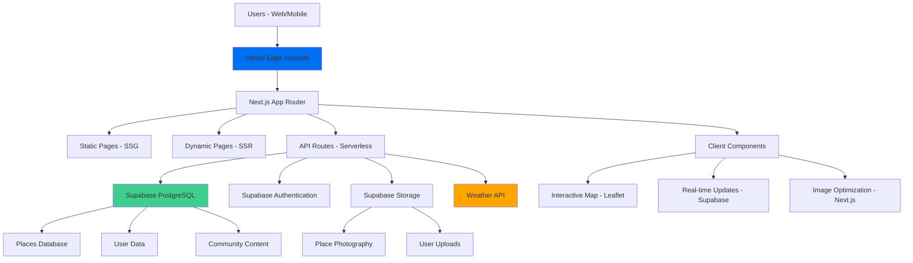

# High Level Architecture

## Technical Summary

The Indiranagar Discovery Platform employs a modern **Jamstack architecture** with Next.js 14+ App Router enabling hybrid SSG/SSR deployment on Vercel's edge network. The backend leverages **Supabase's PostgreSQL** for place data and community features, with **real-time subscriptions** for live updates and **Row Level Security** for secure multi-tenant operations. Key integration points include **weather API** for contextual recommendations, **Leaflet.js** for interactive mapping with custom photography markers, and **Supabase Storage** for optimized image delivery. This architecture achieves the PRD goals of establishing local authority through comprehensive place database, enabling weather-aware discovery, and scaling community engagement within free hosting constraints.

## Platform and Infrastructure Choice

**Platform:** Vercel + Supabase  
**Key Services:** 
- Frontend: Vercel Edge Network, Serverless Functions
- Backend: Supabase PostgreSQL, Authentication, Storage, Real-time
- External: OpenWeatherMap API, Leaflet.js mapping
**Deployment Host and Regions:** Global edge deployment via Vercel with primary regions in Asia-Pacific for Bangalore optimization

## Repository Structure

**Structure:** Monorepo with app-focused organization  
**Monorepo Tool:** npm workspaces (built into Node.js, minimal complexity)  
**Package Organization:** Shared types and utilities in packages/, frontend and API routes co-located in Next.js app structure

## High Level Architecture Diagram

## Architectural Patterns

- **Jamstack Architecture:** Static site generation with serverless APIs for optimal performance and scalability - _Rationale:_ Perfect for content-heavy discovery platform with dynamic community features
- **Component-Based UI:** Reusable React components with TypeScript interfaces from UX specification - _Rationale:_ Maintainability and consistency across weather-aware, photography-rich interfaces
- **API-First Design:** Next.js API routes with type-safe data models - _Rationale:_ Enables future mobile app development and third-party integrations
- **Progressive Enhancement:** Core functionality works without JavaScript, enhanced with interactivity - _Rationale:_ Mobile performance and accessibility for on-location discovery
- **Edge-First Caching:** Strategic caching at CDN, API, and database levels - _Rationale:_ Essential for weather-aware recommendations and real-time map performance
