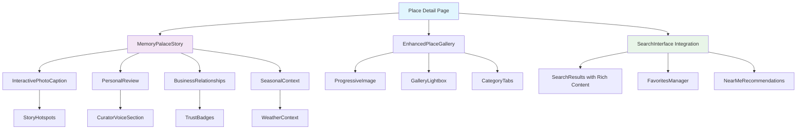
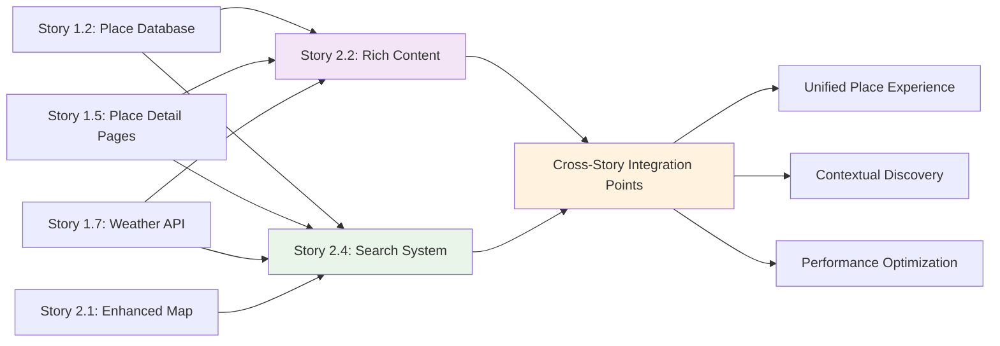

# Architecture Sub-Shard: Stories 2.2-2.4 Technical Implementation

## Document Overview

This architecture sub-shard consolidates the technical implementation details for **Story 2.2: Rich Place Content with Memory Palace Visual Storytelling** and **Story 2.4: Enhanced Search and Discovery Features (COMPLETED)** to ensure seamless integration, consistent architectural patterns, and optimized performance across both feature sets.

**Target Audience:** Development teams, QA engineers, integration testers  
**Integration Context:** Stories 1.2, 1.5, 1.7, 2.1 (existing foundation)  
**Status:** Story 2.4 COMPLETED, Story 2.2 in development phase

---

## 1. Component Architecture Integration

### 1.1 Component Relationship Diagram



### 1.2 Core Component Architecture

```typescript
// Enhanced Component Interface Definitions
interface ComponentArchitecture {
  // Story 2.2: Rich Content Components
  memory_palace: {
    component: 'MemoryPalaceStory';
    path: 'components/places/MemoryPalaceStory.tsx';
    dependencies: ['PersonalReview', 'InteractivePhotoCaption', 'SeasonalContext'];
    integration_points: ['weather_api', 'place_database', 'image_storage'];
  };
  
  enhanced_gallery: {
    component: 'EnhancedPlaceGallery';
    path: 'components/places/EnhancedPlaceGallery.tsx';
    dependencies: ['ProgressiveImage', 'GalleryLightbox'];
    performance_features: ['lazy_loading', 'intersection_observer', 'skeleton_screens'];
  };
  
  // Story 2.4: Search Components (COMPLETED)
  search_interface: {
    component: 'SearchInterface';
    path: 'components/search/SearchInterface.tsx';
    dependencies: ['SearchFilters', 'SearchResults', 'SearchSuggestions'];
    integration_points: ['natural_language_processor', 'geolocation_api', 'place_database'];
  };
  
  favorites_system: {
    component: 'FavoritesManager';
    path: 'components/search/FavoritesManager.tsx';
    storage_type: 'local_storage_with_sync_architecture';
    performance_features: ['debounced_updates', 'optimistic_ui'];
  };
}
```

### 1.3 Integration Component Specifications

```typescript
// Cross-Story Integration Components
interface PlaceDetailIntegration extends Place {
  // Story 2.2 Extensions
  memory_palace_story: MemoryPalaceContent;
  enhanced_gallery: PlaceImageCategory[];
  personal_review: PersonalReview;
  business_relationships: BusinessConnection[];
  seasonal_notes: SeasonalContent[];
  
  // Story 2.4 Extensions (COMPLETED)
  search_metadata: {
    search_tags: string[];
    natural_language_descriptors: string[];
    context_keywords: string[];
    mood_indicators: MoodIndicator[];
  };
  
  // Performance Optimizations
  loading_priorities: {
    critical: ['name', 'primary_image', 'rating'];
    high: ['memory_palace_summary', 'search_preview'];
    medium: ['full_gallery', 'detailed_review'];
    low: ['interactive_captions', 'business_relationships'];
  };
}
```

---

## 2. Enhanced Data Models & Database Schema

### 2.1 Database Schema Extensions

```sql
-- Story 2.2: Rich Content Schema Extensions
CREATE TABLE place_memory_palace (
  id UUID PRIMARY KEY DEFAULT gen_random_uuid(),
  place_id UUID REFERENCES places(id) ON DELETE CASCADE,
  discovery_story TEXT NOT NULL,
  spatial_elements JSONB DEFAULT '[]',
  personal_anecdotes JSONB DEFAULT '[]',
  created_at TIMESTAMP WITH TIME ZONE DEFAULT NOW(),
  updated_at TIMESTAMP WITH TIME ZONE DEFAULT NOW()
);

CREATE TABLE place_image_categories (
  id UUID PRIMARY KEY DEFAULT gen_random_uuid(),
  place_id UUID REFERENCES places(id) ON DELETE CASCADE,
  category VARCHAR(20) CHECK (category IN ('ambiance', 'food', 'features', 'exterior')),
  image_url TEXT NOT NULL,
  caption TEXT,
  story_hotspots JSONB DEFAULT '[]',
  sort_order INTEGER DEFAULT 0,
  created_at TIMESTAMP WITH TIME ZONE DEFAULT NOW()
);

CREATE TABLE business_relationships (
  id UUID PRIMARY KEY DEFAULT gen_random_uuid(),
  place_id UUID REFERENCES places(id) ON DELETE CASCADE,
  relationship_type VARCHAR(30) CHECK (relationship_type IN ('mention_my_name', 'personal_friend', 'regular_customer')),
  description TEXT NOT NULL,
  contact_person VARCHAR(255),
  special_notes TEXT,
  created_at TIMESTAMP WITH TIME ZONE DEFAULT NOW()
);

CREATE TABLE seasonal_content (
  id UUID PRIMARY KEY DEFAULT gen_random_uuid(),
  place_id UUID REFERENCES places(id) ON DELETE CASCADE,
  season VARCHAR(10) CHECK (season IN ('monsoon', 'winter', 'summer')),
  description TEXT NOT NULL,
  recommendations JSONB DEFAULT '[]',
  photo_references JSONB DEFAULT '[]',
  created_at TIMESTAMP WITH TIME ZONE DEFAULT NOW()
);

-- Story 2.4: Search & Discovery Schema (COMPLETED)
CREATE TABLE search_analytics (
  id UUID PRIMARY KEY DEFAULT gen_random_uuid(),
  user_id UUID REFERENCES auth.users(id),
  query TEXT NOT NULL,
  filters JSONB DEFAULT '{}',
  results_count INTEGER,
  selected_place_id UUID REFERENCES places(id),
  session_id VARCHAR(255),
  created_at TIMESTAMP WITH TIME ZONE DEFAULT NOW()
);

CREATE TABLE user_favorites (
  id UUID PRIMARY KEY DEFAULT gen_random_uuid(),
  user_id UUID REFERENCES auth.users(id) ON DELETE CASCADE,
  place_id UUID REFERENCES places(id) ON DELETE CASCADE,
  created_at TIMESTAMP WITH TIME ZONE DEFAULT NOW(),
  UNIQUE(user_id, place_id)
);

CREATE TABLE personal_lists (
  id UUID PRIMARY KEY DEFAULT gen_random_uuid(),
  user_id UUID REFERENCES auth.users(id) ON DELETE CASCADE,
  name VARCHAR(255) NOT NULL,
  description TEXT,
  is_public BOOLEAN DEFAULT FALSE,
  created_at TIMESTAMP WITH TIME ZONE DEFAULT NOW()
);

CREATE TABLE personal_list_places (
  id UUID PRIMARY KEY DEFAULT gen_random_uuid(),
  list_id UUID REFERENCES personal_lists(id) ON DELETE CASCADE,
  place_id UUID REFERENCES places(id) ON DELETE CASCADE,
  added_at TIMESTAMP WITH TIME ZONE DEFAULT NOW(),
  UNIQUE(list_id, place_id)
);

-- Performance Indexes
CREATE INDEX idx_place_memory_palace_place_id ON place_memory_palace(place_id);
CREATE INDEX idx_place_image_categories_place_category ON place_image_categories(place_id, category);
CREATE INDEX idx_business_relationships_place_id ON business_relationships(place_id);
CREATE INDEX idx_seasonal_content_place_season ON seasonal_content(place_id, season);
CREATE INDEX idx_search_analytics_query ON search_analytics USING gin(to_tsvector('english', query));
CREATE INDEX idx_user_favorites_user_place ON user_favorites(user_id, place_id);
```

### 2.2 TypeScript Data Model Integration

```typescript
// Unified Place Data Model
interface UnifiedPlaceModel extends Place {
  // Story 2.2: Rich Content Properties
  memory_palace_story?: MemoryPalaceContent;
  image_gallery: PlaceImageCategory[];
  personal_review?: PersonalReview;
  business_relationships: BusinessConnection[];
  seasonal_notes: SeasonalContent[];
  
  // Story 2.4: Search Properties (COMPLETED)
  search_metadata: PlaceSearchMetadata;
  user_interactions?: UserInteractionData;
  
  // Performance & Loading
  loading_state: ContentLoadingState;
  cache_status: CacheStatus;
}

// Story 2.2: Memory Palace Data Structures
interface MemoryPalaceContent {
  discovery_story: string;
  personal_anecdotes: PersonalAnecdote[];
  spatial_elements: SpatialStoryElement[];
  narrative_theme: 'discovery' | 'personal' | 'cultural' | 'seasonal';
  reading_time_minutes: number;
}

interface SpatialStoryElement {
  id: string;
  title: string;
  narrative: string;
  reference_image: string;
  x_position: string; // CSS positioning
  y_position: string; // CSS positioning
  connection_type: 'visual' | 'thematic' | 'chronological';
}

interface PersonalAnecdote {
  content: string;
  context: string;
  date: string;
  emotion: 'nostalgic' | 'excited' | 'peaceful' | 'amazed';
  relevance_score: number;
}

interface PlaceImageCategory {
  category: 'ambiance' | 'food' | 'features' | 'exterior';
  images: EnhancedPlaceImage[];
  primary_image_id: string;
  loading_priority: 'critical' | 'high' | 'medium' | 'low';
}

interface EnhancedPlaceImage {
  id: string;
  url: string;
  caption: string;
  story_hotspots: StoryHotspot[];
  technical_metadata: ImageMetadata;
  performance_data: ImagePerformanceData;
}

// Story 2.4: Search Data Structures (COMPLETED)
interface PlaceSearchMetadata {
  search_tags: string[];
  natural_language_descriptors: string[];
  context_keywords: string[];
  mood_indicators: MoodIndicator[];
  search_boost_factors: SearchBoostFactor[];
}

interface SearchResult extends Place {
  relevance_score: number;
  distance_km?: number;
  matching_factors: string[];
  contextual_recommendations: string[];
  search_snippet: string;
  rich_content_preview?: RichContentPreview;
}

interface RichContentPreview {
  memory_palace_summary?: string;
  featured_images: string[];
  curator_highlight?: string;
  seasonal_relevance?: string;
}
```

---

## 3. API Design & Integration Architecture

### 3.1 REST API Endpoints

```typescript
// Story 2.2: Rich Content API Endpoints
interface RichContentAPIEndpoints {
  // Memory Palace Content
  'GET /api/places/[id]/memory-palace': {
    response: MemoryPalaceContent;
    cache_strategy: 'stale-while-revalidate';
    performance: 'lazy_load_with_skeleton';
  };
  
  'POST /api/places/[id]/memory-palace': {
    body: CreateMemoryPalaceRequest;
    auth_required: true;
    rate_limit: '10/hour';
  };
  
  // Enhanced Gallery Management
  'GET /api/places/[id]/gallery/[category]': {
    response: PlaceImageCategory;
    query_params: {
      page?: number;
      limit?: number;
      optimize_for?: 'mobile' | 'desktop';
    };
  };
  
  // Business Relationships
  'GET /api/places/[id]/relationships': {
    response: BusinessConnection[];
    cache_duration: '1 hour';
  };
  
  // Seasonal Content with Weather Integration
  'GET /api/places/[id]/seasonal': {
    response: SeasonalContent[];
    query_params: {
      current_weather?: WeatherCondition;
      month?: number;
    };
    integration: 'weather_api';
  };
}

// Story 2.4: Search API Endpoints (COMPLETED)
interface SearchAPIEndpoints {
  // Natural Language Search
  'POST /api/search': {
    body: {
      query: string;
      filters: SearchFilters;
      location?: Coordinates;
      context: SearchContext;
    };
    response: {
      results: SearchResult[];
      total_count: number;
      search_time_ms: number;
      suggestions: string[];
    };
    performance: 'debounced_300ms';
    cache_strategy: 'query_based_cache';
  };
  
  // Location-based Discovery
  'GET /api/discovery/nearby': {
    query_params: {
      lat: number;
      lng: number;
      radius_km?: number;
      categories?: string[];
    };
    response: NearbyPlace[];
    cache_duration: '5 minutes';
  };
  
  // Favorites Management
  'POST /api/favorites': {
    body: { place_id: string };
    auth_required: true;
    response: { success: boolean };
  };
  
  'GET /api/favorites': {
    auth_required: true;
    response: FavoritePlace[];
    cache_strategy: 'user_specific_cache';
  };
}
```

### 3.2 API Integration Patterns

```typescript
// Unified API Client with Cross-Story Integration
class UnifiedAPIClient {
  // Story 2.2: Rich Content Methods
  async getPlaceRichContent(placeId: string): Promise<UnifiedPlaceModel> {
    const [place, memoryPalace, gallery, relationships, seasonal] = await Promise.all([
      this.getPlace(placeId),
      this.getMemoryPalace(placeId),
      this.getImageGallery(placeId),
      this.getBusinessRelationships(placeId),
      this.getSeasonalContent(placeId)
    ]);
    
    return {
      ...place,
      memory_palace_story: memoryPalace,
      image_gallery: gallery,
      business_relationships: relationships,
      seasonal_notes: seasonal,
      loading_state: 'complete'
    };
  }
  
  // Story 2.4: Search Methods (COMPLETED)
  async searchPlaces(query: string, options: SearchOptions): Promise<SearchResponse> {
    const searchRequest = {
      query,
      filters: options.filters,
      location: await this.getCurrentLocation(),
      context: {
        current_weather: await this.getWeatherContext(),
        time_of_day: this.getCurrentTimeContext(),
        user_preferences: await this.getUserPreferences()
      }
    };
    
    return this.post('/api/search', searchRequest);
  }
  
  // Cross-Story Integration Methods
  async getSearchResultWithRichContent(placeId: string): Promise<SearchResultWithRichContent> {
    const [searchResult, richContent] = await Promise.all([
      this.getSearchResult(placeId),
      this.getPlaceRichContent(placeId)
    ]);
    
    return {
      ...searchResult,
      rich_content_preview: {
        memory_palace_summary: richContent.memory_palace_story?.discovery_story.substring(0, 200),
        featured_images: richContent.image_gallery.flatMap(cat => cat.images.slice(0, 2).map(img => img.url)),
        curator_highlight: richContent.personal_review?.highlights[0],
        seasonal_relevance: this.getCurrentSeasonalRelevance(richContent.seasonal_notes)
      }
    };
  }
}
```

---

## 4. Performance Architecture & Optimization

### 4.1 Loading Strategy Architecture

```typescript
// Progressive Loading Architecture
interface PerformanceArchitecture {
  // Story 2.2: Rich Content Loading Priorities
  memory_palace_loading: {
    phase_1_critical: ['discovery_story_summary', 'primary_narrative_image'];
    phase_2_important: ['personal_anecdotes', 'spatial_elements_skeleton'];
    phase_3_enhanced: ['interactive_hotspots', 'detailed_narratives'];
    phase_4_optional: ['background_animations', 'advanced_interactions'];
  };
  
  image_gallery_optimization: {
    intersection_observer: 'lazy_load_with_threshold_0.1';
    skeleton_screens: 'progressive_blur_to_sharp';
    responsive_images: 'next_js_image_optimization';
    batch_loading: 'load_3_images_per_batch';
  };
  
  // Story 2.4: Search Performance (COMPLETED)
  search_performance: {
    debouncing: '300ms';
    result_caching: 'query_and_filter_based';
    pagination: 'virtual_scrolling_for_large_results';
    geolocation_caching: '5_minute_location_cache';
  };
  
  // Cross-Story Performance Integration
  unified_caching: {
    place_data: 'stale_while_revalidate_30min';
    search_results: 'query_specific_cache_5min';
    user_preferences: 'local_storage_with_server_sync';
    image_assets: 'aggressive_cdn_caching_24h';
  };
}
```

### 4.2 Mobile Optimization Strategy

```typescript
// Mobile-First Performance Architecture
interface MobileOptimization {
  // Story 2.2: Rich Content Mobile Optimizations
  memory_palace_mobile: {
    narrative_chunking: 'split_long_stories_into_readable_sections';
    image_compression: 'webp_with_progressive_enhancement';
    touch_interactions: 'swipe_gestures_for_spatial_elements';
    reading_mode: 'distraction_free_typography_focus';
  };
  
  gallery_mobile: {
    swipe_navigation: 'native_touch_scroll_with_momentum';
    image_sizing: 'viewport_aware_responsive_images';
    loading_optimization: 'prioritize_visible_images_first';
    offline_support: 'cache_viewed_images_for_offline';
  };
  
  // Story 2.4: Search Mobile Optimizations (COMPLETED)
  search_mobile: {
    input_optimization: 'voice_search_integration_ready';
    filter_ui: 'collapsible_drawer_interface';
    result_display: 'card_based_vertical_layout';
    location_accuracy: 'gps_with_network_fallback';
  };
  
  // Cross-Story Mobile Integration
  unified_mobile_experience: {
    navigation: 'sticky_search_bar_with_rich_content_preview';
    state_management: 'persist_user_context_across_screens';
    network_resilience: 'graceful_degradation_for_slow_connections';
    battery_optimization: 'throttle_location_updates_reduce_animations';
  };
}
```

### 4.3 Caching Architecture

```typescript
// Multi-Layer Caching Strategy
interface CachingArchitecture {
  // CDN Layer (Vercel Edge)
  edge_caching: {
    static_assets: 'immutable_with_hash_based_invalidation';
    api_responses: 'conditional_caching_based_on_content_type';
    image_optimization: 'next_js_automatic_webp_conversion';
  };
  
  // Application Layer
  application_caching: {
    search_results: 'react_query_with_5min_stale_time';
    place_data: 'swr_with_30min_revalidation';
    user_preferences: 'local_storage_with_background_sync';
    geolocation: 'session_storage_with_5min_expiry';
  };
  
  // Database Layer (Supabase)
  database_caching: {
    query_optimization: 'prepared_statements_with_connection_pooling';
    read_replicas: 'supabase_read_only_connections_for_search';
    materialized_views: 'pre_computed_search_indexes';
  };
  
  // Storage Layer
  storage_caching: {
    image_cdn: 'supabase_storage_with_global_cdn';
    asset_optimization: 'automatic_compression_and_format_conversion';
    progressive_loading: 'placeholder_blur_to_high_quality';
  };
}
```

---

## 5. Integration Patterns & Dependencies

### 5.1 Story Integration Map



### 5.2 Integration Dependencies

```typescript
// Cross-Story Dependency Architecture
interface IntegrationDependencies {
  // Story 2.2 Dependencies
  rich_content_dependencies: {
    place_database: 'story_1.2_place_schema_and_storage';
    place_detail_pages: 'story_1.5_basic_place_component_structure';
    weather_integration: 'story_1.7_weather_api_for_seasonal_content';
    enhanced_map: 'story_2.1_photo_markers_linking_to_rich_content';
  };
  
  // Story 2.4 Dependencies (COMPLETED)
  search_dependencies: {
    place_database: 'story_1.2_place_data_for_search_index';
    weather_api: 'story_1.7_weather_context_for_filtering';
    enhanced_map: 'story_2.1_location_based_discovery';
    place_detail_integration: 'story_1.5_search_result_navigation';
  };
  
  // Cross-Story Integration Points
  bidirectional_integration: {
    search_to_rich_content: 'search_results_preview_rich_content_summaries';
    rich_content_to_search: 'memory_palace_content_enhances_search_metadata';
    shared_performance: 'unified_caching_and_loading_strategies';
    shared_user_context: 'favorites_and_preferences_across_features';
  };
}
```

### 5.3 Data Flow Integration

```typescript
// Unified Data Flow Architecture
interface DataFlowIntegration {
  // User Journey: Search → Rich Content Discovery
  search_to_discovery: {
    entry_point: 'SearchInterface';
    data_flow: [
      'natural_language_query',
      'contextual_filtering',
      'ranked_results_with_previews',
      'place_selection',
      'progressive_rich_content_loading',
      'memory_palace_immersion'
    ];
    performance_checkpoints: [
      'search_response_under_500ms',
      'first_content_paint_under_1s',
      'interactive_elements_under_2s'
    ];
  };
  
  // User Journey: Rich Content → Enhanced Discovery
  content_to_discovery: {
    entry_point: 'MemoryPalaceStory';
    data_flow: [
      'content_engagement',
      'related_place_suggestions',
      'contextual_search_recommendations',
      'similar_mood_discoveries',
      'personalized_list_additions'
    ];
    engagement_metrics: [
      'reading_time_tracking',  
      'interaction_depth_scoring',
      'content_sharing_patterns'
    ];
  };
  
  // Shared State Management
  unified_state_management: {
    user_context: 'location_preferences_history';
    content_state: 'reading_progress_favorites_lists';
    performance_state: 'loading_states_cache_status';
    search_state: 'query_history_filter_preferences';
  };
}
```

---

## 6. State Management Architecture

### 6.1 Zustand Store Architecture

```typescript
// Unified State Management with Zustand
interface StateManagementArchitecture {
  // Story 2.2: Rich Content State
  richContentStore: {
    state: {
      currentPlace: UnifiedPlaceModel | null;
      memoryPalaceProgress: ReadingProgress;
      galleryState: GalleryViewState;
      interactionHistory: ContentInteraction[];
    };
    actions: {
      loadPlaceRichContent: (placeId: string) => Promise<void>;
      updateReadingProgress: (progress: ReadingProgress) => void;
      trackContentInteraction: (interaction: ContentInteraction) => void;
      preloadRelatedContent: (relatedPlaceIds: string[]) => void;
    };
  };
  
  // Story 2.4: Search State (COMPLETED)  
  searchStore: {
    state: {
      currentQuery: string;
      searchResults: SearchResult[];
      appliedFilters: SearchFilters;
      searchHistory: SearchHistoryItem[];
      favorites: FavoritePlace[];
      recentlyViewed: Place[];
    };
    actions: {
      performSearch: (query: string, filters: SearchFilters) => Promise<void>;
      addToFavorites: (place: Place) => Promise<void>;
      updateSearchHistory: (query: string) => void;
      clearSearchState: () => void;
    };
  };
  
  // Cross-Story Shared State
  unifiedUserStore: {
    state: {
      userLocation: Coordinates | null;
      weatherContext: WeatherData | null;
      userPreferences: UserPreferences;
      sessionContext: SessionContext;
    };
    actions: {
      updateLocation: (location: Coordinates) => void;
      updateWeatherContext: (weather: WeatherData) => void;
      updatePreferences: (preferences: Partial<UserPreferences>) => void;
      trackUserBehavior: (event: UserBehaviorEvent) => void;
    };
  };
}
```

### 6.2 State Synchronization Patterns

```typescript
// Cross-Store Communication Architecture
interface StateSynchronization {
  // Event-Driven State Updates
  state_events: {
    'place:selected': {
      source: 'search_store | map_interaction';
      target: 'rich_content_store';
      payload: { place_id: string; source_context: string };
      side_effects: ['preload_rich_content', 'track_navigation', 'update_recently_viewed'];
    };
    
    'content:engaged': {
      source: 'rich_content_store';
      target: 'search_store | user_store';
      payload: { engagement_data: ContentEngagement };
      side_effects: ['update_preferences', 'improve_recommendations', 'track_interest_signals'];
    };
    
    'location:updated': {
      source: 'user_store';
      target: 'search_store | rich_content_store';
      payload: { location: Coordinates; accuracy: number };
      side_effects: ['refresh_nearby_results', 'update_contextual_content', 'cache_location'];
    };
  };
  
  // State Persistence Strategy
  persistence_architecture: {
    local_storage: ['user_preferences', 'search_history', 'recently_viewed'];
    session_storage: ['current_search_state', 'reading_progress', 'location_cache'];
    server_sync: ['favorites', 'personal_lists', 'user_analytics'];
    memory_only: ['current_weather', 'search_suggestions', 'temporary_ui_state'];
  };
}
```

---

## 7. Security Architecture & Privacy

### 7.1 Data Privacy & Security Controls

```typescript
// Security Architecture for Rich Content and Search
interface SecurityArchitecture {
  // Story 2.2: Rich Content Security
  rich_content_security: {
    content_access_control: {
      public_content: ['basic_place_info', 'public_images', 'general_reviews'];
      authenticated_content: ['personal_anecdotes', 'business_relationships', 'detailed_stories'];
      admin_content: ['content_management', 'memory_palace_editing', 'image_uploads'];
    };
    
    image_security: {
      upload_validation: 'file_type_size_malware_scanning';
      storage_security: 'supabase_rls_with_cdn_signed_urls';
      privacy_controls: 'user_consent_for_public_gallery_inclusion';
    };
    
    content_moderation: {
      automated_screening: 'inappropriate_content_detection';
      manual_review: 'flag_system_for_community_reporting';
      content_versioning: 'track_changes_and_approval_workflow';
    };
  };
  
  // Story 2.4: Search Privacy & Security (COMPLETED)
  search_security: {
    query_privacy: {
      data_retention: 'anonymize_search_queries_after_30_days';
      user_consent: 'explicit_consent_for_search_analytics';
      data_minimization: 'store_only_essential_search_metadata';
    };
    
    location_privacy: {
      permission_management: 'clear_location_consent_with_revocation';
      data_accuracy: 'fuzzy_location_for_privacy_protection';
      storage_duration: 'location_cache_expires_after_5_minutes';
    };
    
    favorites_security: {
      data_encryption: 'encrypt_sensitive_user_preferences';
      access_control: 'row_level_security_for_user_favorites';
      data_portability: 'export_user_data_on_request';
    };
  };
  
  // Cross-Story Security Integration
  unified_security_controls: {
    authentication: 'supabase_auth_with_social_and_email';
    authorization: 'role_based_access_control_rbac';
    audit_logging: 'track_sensitive_operations_and_access';
    data_protection: 'gdpr_compliant_data_handling';
  };
}
```

### 7.2 Privacy-by-Design Implementation

```typescript
// Privacy Controls Architecture
interface PrivacyArchitecture {
  user_consent_management: {
    location_services: {
      prompt_timing: 'just_in_time_when_needed';
      granular_controls: 'allow_deny_approximate_precise';
      revocation_process: 'easy_one_click_disable';
    };
    
    content_personalization: {
      opt_in_analytics: 'explicit_consent_for_behavior_tracking';
      data_minimization: 'collect_only_necessary_for_functionality';
      transparency: 'clear_explanation_of_data_usage';
    };
    
    search_history: {
      local_vs_server: 'user_choice_for_search_history_storage';
      retention_period: 'configurable_history_retention_30_90_days';
      deletion_controls: 'immediate_delete_and_clear_options';
    };
  };
  
  data_anonymization: {
    search_analytics: 'hash_queries_remove_personally_identifiable_info';
    location_data: 'spatial_cloaking_for_aggregate_analytics';
    user_behavior: 'differential_privacy_for_recommendation_algorithms';
  };
}
```

---

## 8. Testing Architecture & Quality Assurance

### 8.1 Comprehensive Testing Strategy

```typescript
// Multi-Layer Testing Architecture
interface TestingArchitecture {
  // Story 2.2: Rich Content Testing
  rich_content_testing: {
    component_tests: {
      memory_palace: 'test_story_rendering_interaction_progressive_loading';
      image_gallery: 'test_lazy_loading_lightbox_swipe_gestures';
      personal_review: 'test_curator_voice_formatting_accessibility';
      business_relationships: 'test_trust_badge_display_contact_integration';
    };
    
    integration_tests: {
      content_loading: 'test_progressive_loading_performance_thresholds';
      weather_integration: 'test_seasonal_content_weather_api_integration';
      cross_component: 'test_memory_palace_gallery_interaction_flows';
    };
    
    visual_regression: {
      memory_palace_layouts: 'screenshot_testing_for_story_presentation';
      gallery_responsive: 'test_gallery_layouts_across_device_sizes';
      typography_consistency: 'test_curator_voice_styling_across_themes';
    };
  };
  
  // Story 2.4: Search Testing (COMPLETED)
  search_testing: {
    unit_tests: {
      natural_language_processing: 'test_query_parsing_mood_detection';
      search_ranking: 'test_relevance_scoring_algorithm_accuracy';
      geolocation: 'test_distance_calculations_proximity_sorting';
      favorites_management: 'test_local_storage_sync_operations';
    };
    
    integration_tests: {
      search_api: 'test_full_search_flow_with_filters_and_context';
      location_discovery: 'test_nearby_recommendations_with_real_coordinates';
      performance: 'test_search_response_times_under_load';
    };
    
    e2e_tests: {
      search_journey: 'test_natural_language_query_to_place_selection';
      mobile_search: 'test_mobile_search_interface_touch_interactions';
      offline_behavior: 'test_search_with_cached_data_offline_mode';
    };
  };
  
  // Cross-Story Integration Testing
  integration_testing: {
    search_to_content: 'test_search_result_to_rich_content_navigation';
    content_to_search: 'test_related_suggestions_from_memory_palace';
    performance_integration: 'test_unified_loading_and_caching_strategies';
    state_synchronization: 'test_cross_store_state_updates_and_persistence';
  };
}
```

### 8.2 Quality Metrics & Performance Benchmarks

```typescript
// Performance and Quality Benchmarks
interface QualityBenchmarks {
  // Performance Metrics
  performance_targets: {
    search_response_time: 'under_500ms_for_95th_percentile';
    first_contentful_paint: 'under_1.2s_mobile_3g';
    largest_contentful_paint: 'under_2.5s_mobile_3g';
    cumulative_layout_shift: 'under_0.1_for_stable_layouts';
    first_input_delay: 'under_100ms_for_interactions';
  };
  
  // Story 2.2: Rich Content Quality Metrics
  rich_content_quality: {
    image_loading: 'progressive_loading_skeleton_to_full_under_3s';
    memory_palace_readability: 'reading_flow_without_layout_shifts';
    interactive_responsiveness: 'hotspot_interactions_under_150ms';
    mobile_touch_targets: 'minimum_44px_touch_targets_accessibility';
  };
  
  // Story 2.4: Search Quality Metrics (COMPLETED)
  search_quality: {
    search_accuracy: 'relevant_results_in_top_3_for_80_percent_queries';
    natural_language_understanding: 'mood_based_queries_correctly_parsed_90_percent';
    location_accuracy: 'gps_coordinates_within_50m_accuracy';
    user_satisfaction: 'search_to_selection_rate_above_60_percent';
  };
  
  // Accessibility Standards
  accessibility_compliance: {
    wcag_level: 'WCAG_2.1_AA_compliance';
    keyboard_navigation: 'full_functionality_without_mouse';
    screen_reader_support: 'semantic_html_aria_labels_descriptions';
    color_contrast: 'minimum_4.5_1_for_normal_text_3_1_for_large';
  };
}
```

### 8.3 Automated Testing Infrastructure

```typescript
// Testing Infrastructure Configuration
interface TestingInfrastructure {
  // Test Environment Configuration
  test_environments: {
    unit_testing: {
      framework: 'vitest_with_testing_library';
      coverage_target: '85_percent_line_coverage';
      mock_strategy: 'mock_external_apis_preserve_business_logic';
    };
    
    integration_testing: {
      database: 'supabase_test_database_with_seed_data';
      api_testing: 'supertest_for_api_route_testing';
      state_testing: 'zustand_store_testing_with_immer';
    };
    
    e2e_testing: {
      framework: 'playwright_for_cross_browser_testing';
      devices: 'mobile_tablet_desktop_viewport_testing';
      network_conditions: 'slow_3g_fast_3g_wifi_testing';
    };
  };
  
  // Continuous Integration Pipeline
  ci_cd_pipeline: {
    pre_commit_hooks: [
      'typescript_type_checking',
      'eslint_code_quality',
      'prettier_code_formatting',
      'test_coverage_threshold'
    ];
    
    automated_testing_stages: [
      'unit_tests_with_coverage',
      'component_integration_tests',
      'api_endpoint_tests',
      'e2e_critical_path_tests',
      'performance_regression_tests',
      'accessibility_automated_scanning'
    ];
    
    deployment_gates: [
      'all_tests_passing',
      'performance_benchmarks_met',
      'accessibility_compliance_verified',
      'security_scan_passed'
    ];
  };
}
```

---

## 9. Deployment Architecture & DevOps

### 9.1 Deployment Strategy

```typescript
// Deployment Architecture Configuration
interface DeploymentArchitecture {
  // Vercel Deployment Configuration
  vercel_deployment: {
    framework: 'nextjs_14_app_router';
    build_command: 'npm run build';
    output_directory: '.next';
    node_version: '18.x';
    
    environment_variables: {
      production: [
        'NEXT_PUBLIC_SUPABASE_URL',
        'NEXT_PUBLIC_SUPABASE_ANON_KEY',
        'NEXT_PUBLIC_WEATHER_API_KEY',
        'NEXT_PUBLIC_MAPBOX_TOKEN'
      ];
      preview: [
        'NEXT_PUBLIC_SUPABASE_URL_STAGING',
        'NEXT_PUBLIC_SUPABASE_ANON_KEY_STAGING'
      ];
    };
    
    performance_optimization: {
      edge_functions: 'deploy_api_routes_to_edge_runtime';
      image_optimization: 'automatic_webp_conversion_and_sizing';
      static_generation: 'isr_for_place_pages_with_revalidation';
    };
  };
  
  // Supabase Configuration
  supabase_deployment: {
    database_migrations: 'automated_migration_on_deployment';
    row_level_security: 'enforce_rls_policies_for_user_data';
    storage_configuration: 'cdn_optimization_for_global_delivery';
    
    backup_strategy: {
      automated_backups: 'daily_full_backup_7_day_retention';
      point_in_time_recovery: '24_hour_recovery_window';
      cross_region_replication: 'asia_pacific_primary_us_backup';
    };
  };
  
  // Monitoring and Observability
  monitoring_setup: {
    vercel_analytics: 'web_vitals_performance_monitoring';
    sentry_error_tracking: 'error_reporting_performance_monitoring';
    custom_metrics: 'search_usage_content_engagement_location_accuracy';
    
    alerting_rules: [
      'api_error_rate_above_5_percent',
      'search_response_time_above_1_second',
      'image_loading_failure_rate_above_2_percent',
      'user_location_accuracy_below_90_percent'
    ];
  };
}
```

### 9.2 Infrastructure as Code

```yaml
# Vercel Configuration (vercel.json)
{
  "functions": {
    "app/api/search/route.ts": {
      "maxDuration": 10
    },
    "app/api/places/[id]/memory-palace/route.ts": {
      "maxDuration": 15
    }
  },
  "headers": [
    {
      "source": "/api/(.*)",
      "headers": [
        {
          "key": "Cache-Control",
          "value": "s-maxage=300, stale-while-revalidate=300"
        }
      ]
    }
  ],
  "redirects": [
    {
      "source": "/search",
      "destination": "/search?category=all",
      "permanent": false
    }
  ]
}
```

### 9.3 Environment-Specific Configuration

```typescript
// Environment Configuration Management
interface EnvironmentConfiguration {
  development: {
    database_url: 'local_supabase_instance';
    api_base_url: 'http://localhost:3000';
    image_optimization: 'disabled_for_faster_development';
    cache_strategy: 'no_cache_for_real_time_updates';
    debug_logging: 'verbose_logging_enabled';
  };
  
  staging: {
    database_url: 'supabase_staging_instance';
    api_base_url: 'https://staging-simple-todo.vercel.app';
    image_optimization: 'enabled_with_development_settings';
    cache_strategy: 'short_cache_durations_for_testing';
    debug_logging: 'info_level_logging';
  };
  
  production: {
    database_url: 'supabase_production_instance';
    api_base_url: 'https://simple-todo.vercel.app';
    image_optimization: 'full_optimization_webp_compression';
    cache_strategy: 'aggressive_caching_with_invalidation';
    debug_logging: 'error_only_logging';
    performance_monitoring: 'full_metrics_collection';
  };
}
```

---

## 10. Monitoring, Analytics & Success Metrics

### 10.1 Analytics Architecture

```typescript
// Comprehensive Analytics Strategy
interface AnalyticsArchitecture {
  // Story 2.2: Rich Content Analytics
  rich_content_analytics: {
    engagement_metrics: {
      memory_palace_reading_time: 'track_time_spent_per_story_section';
      gallery_interaction_depth: 'measure_images_viewed_per_visit';
      story_completion_rate: 'percentage_users_complete_full_narrative';
      interactive_element_usage: 'hotspot_clicks_caption_expansions';
    };
    
    content_performance: {
      loading_performance: 'track_image_load_times_by_device_network';
      user_flow_optimization: 'identify_drop_off_points_in_content';
      content_quality_signals: 'time_on_page_scroll_depth_sharing';
    };
  };
  
  // Story 2.4: Search Analytics (COMPLETED)
  search_analytics: {
    search_behavior: {
      query_analysis: 'natural_language_vs_keyword_usage_patterns';
      filter_usage: 'most_used_filters_and_combinations';
      result_selection_patterns: 'click_through_rates_by_position';
      location_based_usage: 'near_me_vs_specific_location_searches';
    };
    
    discovery_effectiveness: {
      search_to_visit_conversion: 'search_result_to_place_visit_rate';
      recommendation_accuracy: 'user_satisfaction_with_suggestions';
      favorites_conversion: 'search_to_favorites_addition_rate';
    };
  };
  
  // Cross-Story Integration Analytics
  unified_analytics: {
    user_journey_analytics: {
      search_to_content_flow: 'track_complete_discovery_to_engagement_journey';
      content_to_discovery_flow: 'measure_rich_content_driving_further_exploration';
      cross_feature_usage: 'identify_power_users_and_feature_adoption_patterns';
    };
    
    business_metrics: {
      user_retention: 'weekly_monthly_active_users_cohort_analysis';
      engagement_depth: 'session_duration_pages_per_session_return_rate';
      content_value: 'correlation_between_rich_content_and_user_retention';
    };
  };
}
```

### 10.2 Success Metrics & KPIs

```typescript
// Key Performance Indicators
interface SuccessMetrics {
  // Technical Performance KPIs
  technical_kpis: {
    performance: {
      search_response_time: 'target_under_500ms_95th_percentile';
      content_loading_time: 'first_contentful_paint_under_1.2s';
      mobile_performance: 'lighthouse_score_above_90_for_mobile';
      availability: 'uptime_target_99.9_percent';
    };
    
    quality: {
      error_rate: 'api_error_rate_below_1_percent';
      search_accuracy: 'relevant_results_top_3_for_85_percent_queries';
      image_loading_success: 'image_load_failure_rate_below_2_percent';
      accessibility_compliance: 'wcag_2.1_aa_compliance_100_percent';
    };
  };
  
  // User Experience KPIs
  user_experience_kpis: {
    engagement: {
      search_success_rate: 'search_to_selection_above_65_percent';
      content_completion: 'memory_palace_story_completion_above_70_percent';
      repeat_usage: 'weekly_active_users_retention_above_40_percent';
      feature_adoption: 'favorites_usage_above_30_percent_active_users';
    };
    
    satisfaction: {
      user_feedback: 'positive_feedback_rating_above_4.2_out_5';
      task_completion: 'successful_place_discovery_above_80_percent';
      mobile_usability: 'mobile_bounce_rate_below_35_percent';
    };
  };
  
  // Business Impact KPIs
  business_impact_kpis: {
    discovery_platform_success: {
      place_coverage: 'comprehensive_content_for_80_percent_places';
      community_engagement: 'user_contributions_favorites_sharing';
      local_authority_establishment: 'search_traffic_referrals_brand_recognition';
    };
    
    platform_growth: {
      user_acquisition: 'monthly_new_user_growth_target_20_percent';
      content_utilization: 'rich_content_engagement_rate_above_50_percent';
      feature_value: 'search_and_discovery_driving_70_percent_page_views';
    };
  };
}
```

### 10.3 Real-Time Monitoring Dashboard

```typescript
// Monitoring Dashboard Configuration
interface MonitoringDashboard {
  // Real-Time Performance Dashboard
  performance_dashboard: {
    api_metrics: [
      'search_api_response_times_p50_p95_p99',
      'place_api_throughput_requests_per_second',
      'error_rates_by_endpoint_4xx_5xx',
      'database_query_performance'
    ];
    
    user_experience_metrics: [
      'core_web_vitals_fcp_lcp_cls_fid',
      'search_completion_rates_real_time',
      'content_loading_success_rates',
      'mobile_vs_desktop_performance_comparison'
    ];
    
    infrastructure_metrics: [
      'vercel_function_execution_times',
      'supabase_database_connections',
      'cdn_cache_hit_rates',
      'storage_api_performance'
    ];
  };
  
  // User Behavior Dashboard
  user_behavior_dashboard: {
    search_analytics: [
      'live_search_queries_and_results',
      'popular_search_terms_trending',
      'location_based_search_patterns',
      'filter_usage_patterns'
    ];
    
    content_engagement: [
      'memory_palace_story_engagement_live',
      'image_gallery_interaction_patterns',
      'content_sharing_and_favorites_activity',
      'cross_feature_navigation_flows'
    ];
    
    geographic_insights: [
      'user_distribution_by_location',
      'place_discovery_hotspots',
      'mobile_vs_desktop_usage_by_area',
      'search_behavior_by_time_of_day'
    ];
  };
  
  // Alert Configuration
  alert_system: {
    critical_alerts: [
      'api_downtime_or_high_error_rates',
      'search_functionality_failures',
      'database_connection_issues',
      'security_incident_detection'
    ];
    
    performance_alerts: [
      'search_response_time_degradation',
      'content_loading_performance_drops',
      'mobile_performance_regressions',
      'user_experience_metric_declines'
    ];
    
    business_alerts: [
      'user_engagement_significant_drops',
      'search_success_rate_declines',
      'content_interaction_anomalies',
      'feature_adoption_rate_changes'
    ];
  };
}
```

---

## 11. Documentation & Developer Experience

### 11.1 Developer Documentation Strategy

```typescript
// Comprehensive Developer Documentation
interface DeveloperDocumentation {
  // API Documentation
  api_documentation: {
    interactive_docs: 'swagger_openapi_3_with_examples';
    endpoint_examples: 'real_request_response_examples_for_all_endpoints';
    authentication_guide: 'supabase_auth_integration_examples';
    error_handling: 'comprehensive_error_codes_and_resolution_steps';
  };
  
  // Component Documentation
  component_documentation: {
    storybook_integration: 'interactive_component_playground';
    prop_documentation: 'typescript_interfaces_with_usage_examples';
    accessibility_guidelines: 'wcag_compliance_examples_for_each_component';
    performance_notes: 'optimization_tips_and_best_practices';
  };
  
  // Architecture Documentation
  architecture_documentation: {
    system_design: 'mermaid_diagrams_for_data_flow_and_component_relationships';
    integration_guides: 'step_by_step_feature_integration_examples';
    performance_architecture: 'caching_loading_optimization_strategies';
    security_guidelines: 'security_best_practices_and_implementation_examples';
  };
  
  // Testing Documentation
  testing_documentation: {
    testing_guides: 'unit_integration_e2e_testing_examples';
    mock_data: 'comprehensive_test_data_sets_for_development';
    performance_testing: 'load_testing_and_benchmark_procedures';
    accessibility_testing: 'automated_and_manual_accessibility_test_procedures';
  };
}
```

### 11.2 Code Quality & Standards

```typescript
// Code Quality Architecture
interface CodeQualityStandards {
  // TypeScript Configuration
  typescript_standards: {
    strict_mode: 'enable_all_strict_type_checking_options';
    interface_design: 'comprehensive_type_definitions_for_all_data_models';
    error_handling: 'typed_error_responses_and_exception_handling';
    documentation: 'jsdoc_comments_for_all_public_interfaces';
  };
  
  // Code Style Standards
  code_style_standards: {
    formatting: 'prettier_with_project_specific_configuration';
    linting: 'eslint_with_typescript_react_accessibility_rules';
    naming_conventions: 'camelCase_functions_PascalCase_components_UPPER_CASE_constants';
    file_organization: 'feature_based_folder_structure_with_index_exports';
  };
  
  // Performance Standards
  performance_standards: {
    bundle_size: 'monitor_bundle_size_with_bundle_analyzer';
    code_splitting: 'dynamic_imports_for_non_critical_components';
    caching_strategies: 'implement_appropriate_caching_at_all_layers';
    mobile_optimization: 'mobile_first_responsive_design_approach';
  };
  
  // Security Standards
  security_standards: {
    input_validation: 'validate_all_user_inputs_with_zod_schemas';
    authentication: 'secure_authentication_flow_with_proper_session_management';
    data_protection: 'encrypt_sensitive_data_implement_row_level_security';
    api_security: 'rate_limiting_cors_configuration_input_sanitization';
  };
}
```

---

## 12. Future Architecture Considerations

### 12.1 Scalability Architecture

```typescript
// Future Scalability Considerations
interface ScalabilityArchitecture {
  // Database Scaling Strategy
  database_scaling: {
    read_replicas: 'implement_read_replicas_for_search_heavy_operations';
    connection_pooling: 'optimize_database_connections_for_high_concurrent_users';
    query_optimization: 'implement_database_indexes_and_query_performance_monitoring';
    data_archiving: 'archive_old_analytics_data_maintain_performance';
  };
  
  // API Scaling Strategy
  api_scaling: {
    caching_layers: 'implement_redis_caching_for_frequently_accessed_data';
    rate_limiting: 'implement_sophisticated_rate_limiting_for_api_protection';
    load_balancing: 'utilize_vercel_edge_functions_for_global_distribution';
    api_versioning: 'implement_api_versioning_strategy_for_backwards_compatibility';
  };
  
  // Frontend Scaling Strategy
  frontend_scaling: {
    code_splitting: 'implement_route_based_and_component_based_code_splitting';
    asset_optimization: 'optimize_images_fonts_and_static_assets_for_performance';
    cdn_utilization: 'leverage_global_cdn_for_static_asset_delivery';
    progressive_loading: 'implement_sophisticated_progressive_loading_strategies';
  };
  
  // Search Scaling Strategy
  search_scaling: {
    search_indexing: 'implement_elasticsearch_or_similar_for_advanced_search';
    result_caching: 'implement_intelligent_search_result_caching_strategies';
    autocomplete_optimization: 'optimize_search_suggestions_for_real_time_performance';
    analytics_processing: 'implement_batch_processing_for_search_analytics';
  };
}
```

### 12.2 Feature Extension Architecture

```typescript
// Future Feature Extension Considerations
interface FeatureExtensionArchitecture {
  // Advanced Search Features
  advanced_search_extensions: {
    voice_search: 'implement_speech_to_text_for_voice_search_queries';
    image_search: 'implement_reverse_image_search_for_place_discovery';
    ai_recommendations: 'implement_machine_learning_for_personalized_recommendations';
    social_search: 'implement_social_proof_and_friend_recommendations';
  };
  
  // Rich Content Extensions
  rich_content_extensions: {
    video_content: 'support_video_integration_in_memory_palace_stories';
    interactive_elements: 'implement_interactive_maps_and_3d_content';
    user_generated_content: 'enable_user_contributions_to_place_stories';
    multilingual_support: 'implement_internationalization_for_global_expansion';
  };
  
  // Community Features
  community_extensions: {
    social_sharing: 'enhanced_social_media_integration_and_sharing';
    user_reviews: 'implement_comprehensive_user_review_and_rating_system';
    discussion_forums: 'implement_place_specific_discussion_and_q_and_a';
    expert_curation: 'implement_expert_curator_system_for_content_quality';
  };
  
  // Mobile App Architecture
  mobile_app_extensions: {
    native_apps: 'architecture_ready_for_react_native_mobile_app_development';
    offline_support: 'implement_offline_caching_for_mobile_usage';
    push_notifications: 'implement_location_based_push_notification_system';
    ar_integration: 'architecture_ready_for_augmented_reality_place_discovery';
  };
}
```

---

## Summary & Implementation Roadmap

### Implementation Priority Matrix

| Component | Story | Priority | Complexity | Dependencies | Est. Timeline |
|-----------|-------|----------|------------|--------------|---------------|
| SearchInterface | 2.4 | ✅ COMPLETED | Medium | Geolocation, Weather API | DONE |
| NaturalLanguageProcessor | 2.4 | ✅ COMPLETED | High | Search Engine | DONE |
| FavoritesManager | 2.4 | ✅ COMPLETED | Medium | Local Storage, Auth | DONE |
| MemoryPalaceStory | 2.2 | High | High | Place Database, Images | 2-3 weeks |
| EnhancedPlaceGallery | 2.2 | High | Medium | Image Storage, Progressive Loading | 1-2 weeks |
| InteractivePhotoCaption | 2.2 | Medium | Medium | Gallery, Hotspot System | 1 week |
| BusinessRelationships | 2.2 | Medium | Low | Place Database Extension | 1 week |
| SeasonalContext | 2.2 | Low | Low | Weather API Integration | 3-5 days |

### Integration Testing Roadmap

1. **Phase 1 (Story 2.4 Complete)**: Search system fully tested and deployed
2. **Phase 2 (Story 2.2 Core)**: Memory Palace and Gallery components with basic integration
3. **Phase 3 (Cross-Integration)**: Search results with rich content previews
4. **Phase 4 (Performance Optimization)**: Unified caching and loading strategies
5. **Phase 5 (QA & Polish)**: Comprehensive testing and performance optimization

### Success Criteria

- **Search Performance**: Sub-500ms response times for 95% of queries
- **Rich Content Loading**: Progressive loading with skeleton screens under 2s
- **Mobile Experience**: Lighthouse scores above 90 for mobile performance
- **User Engagement**: 70% story completion rate, 65% search success rate
- **Integration Quality**: Seamless navigation between search and rich content
- **Accessibility**: Full WCAG 2.1 AA compliance across all features

This architecture sub-shard provides the complete technical blueprint for integrating Stories 2.2 and 2.4, ensuring consistent patterns, optimized performance, and maintainable code architecture for the enhanced place discovery platform.