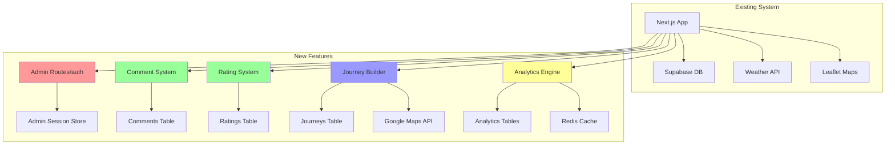

# V2 New Features Architecture Document
## Indiranagar Discovery Platform - Technical Architecture for New Features Only

---

## 1. INTRODUCTION

This architecture document defines the technical implementation approach for NEW features being added to the Indiranagar Discovery Platform. It builds upon the existing Jamstack architecture (Next.js 15 + Supabase) and focuses only on additions, not modifications to existing systems.

### 1.1 Scope
This document covers architectural decisions for:
- Admin Dashboard System (password-protected)
- Comment & Rating Systems (anonymous-capable)
- Journey Builder & Management
- Enhanced Analytics Pipeline
- Call & Directions Integration
- Companion Activities Engine
- Advanced Weather Features

### 1.2 Architecture Principles
- **Incremental Enhancement** - Add features without breaking existing functionality
- **Database Extension** - New tables, don't modify existing schema
- **API Addition** - New routes alongside existing ones
- **Component Isolation** - New features in separate components
- **Performance First** - Caching and optimization from day one

---

## 2. SYSTEM ARCHITECTURE OVERVIEW

### 2.1 High-Level Architecture Extension



---

## 3. ADMIN DASHBOARD ARCHITECTURE

### 3.1 Authentication Strategy
**Approach**: Server-side password verification with JWT session tokens

```typescript
// lib/admin/auth.ts
export class AdminAuth {
  private static readonly ADMIN_PASSWORD_HASH = process.env.ADMIN_PASSWORD_HASH;
  private static readonly JWT_SECRET = process.env.JWT_SECRET;
  
  static async verifyPassword(password: string): Promise<boolean> {
    return await bcrypt.compare(password, this.ADMIN_PASSWORD_HASH);
  }
  
  static generateToken(): string {
    return jwt.sign(
      { role: 'admin', exp: Date.now() + 24 * 60 * 60 * 1000 },
      this.JWT_SECRET
    );
  }
  
  static verifyToken(token: string): boolean {
    try {
      const decoded = jwt.verify(token, this.JWT_SECRET);
      return decoded.role === 'admin' && decoded.exp > Date.now();
    } catch {
      return false;
    }
  }
}
```

### 3.2 Admin Middleware
```typescript
// middleware.ts (addition to existing)
export async function middleware(request: NextRequest) {
  if (request.nextUrl.pathname.startsWith('/admin')) {
    const token = request.cookies.get('admin-token');
    
    if (!token || !AdminAuth.verifyToken(token.value)) {
      return NextResponse.redirect(new URL('/admin/login', request.url));
    }
  }
  
  return NextResponse.next();
}

export const config = {
  matcher: ['/admin/:path*']
};
```

### 3.3 Admin API Routes Structure
```
app/api/admin/
├── auth/
│   └── route.ts           # POST: Login endpoint
├── places/
│   ├── route.ts          # GET/POST: List and create
│   └── [id]/
│       └── route.ts      # PUT/DELETE: Update and delete
├── analytics/
│   └── route.ts          # GET: Analytics data
├── settings/
│   └── route.ts          # GET/PUT: Platform settings
└── export/
    └── route.ts          # POST: Export data
```

---

## 4. DATABASE SCHEMA EXTENSIONS

### 4.1 New Tables Design

```sql
-- Admin Settings Table
CREATE TABLE admin_settings (
  id SERIAL PRIMARY KEY,
  key VARCHAR(100) UNIQUE NOT NULL,
  value JSONB NOT NULL,
  updated_at TIMESTAMP DEFAULT NOW()
);

-- Comments Table
CREATE TABLE comments (
  id UUID DEFAULT gen_random_uuid() PRIMARY KEY,
  entity_type VARCHAR(50) NOT NULL, -- 'place', 'journey', 'blog'
  entity_id UUID NOT NULL,
  parent_id UUID REFERENCES comments(id),
  author_name VARCHAR(100) DEFAULT 'Anonymous',
  author_ip INET,
  content TEXT NOT NULL,
  is_admin BOOLEAN DEFAULT FALSE,
  is_flagged BOOLEAN DEFAULT FALSE,
  likes INTEGER DEFAULT 0,
  created_at TIMESTAMP DEFAULT NOW(),
  updated_at TIMESTAMP DEFAULT NOW()
);

-- Ratings Table  
CREATE TABLE ratings (
  id UUID DEFAULT gen_random_uuid() PRIMARY KEY,
  entity_type VARCHAR(50) NOT NULL,
  entity_id UUID NOT NULL,
  rating INTEGER CHECK (rating >= 1 AND rating <= 5),
  ip_address INET,
  created_at TIMESTAMP DEFAULT NOW(),
  UNIQUE(entity_type, entity_id, ip_address) -- One rating per IP
);

-- Journey Tables
CREATE TABLE journeys (
  id UUID DEFAULT gen_random_uuid() PRIMARY KEY,
  slug VARCHAR(200) UNIQUE NOT NULL,
  name VARCHAR(200) NOT NULL,
  description TEXT,
  duration_minutes INTEGER,
  distance_km DECIMAL(5,2),
  difficulty VARCHAR(20),
  mood_tags TEXT[],
  optimal_times JSONB,
  weather_suitability JSONB,
  estimated_cost JSONB,
  hero_image_url TEXT,
  is_published BOOLEAN DEFAULT FALSE,
  view_count INTEGER DEFAULT 0,
  created_by VARCHAR(50) DEFAULT 'amit',
  created_at TIMESTAMP DEFAULT NOW(),
  updated_at TIMESTAMP DEFAULT NOW()
);

CREATE TABLE journey_stops (
  id UUID DEFAULT gen_random_uuid() PRIMARY KEY,
  journey_id UUID REFERENCES journeys(id) ON DELETE CASCADE,
  place_id UUID REFERENCES places(id),
  order_index INTEGER NOT NULL,
  arrival_time_offset INTEGER, -- minutes from start
  recommended_duration INTEGER, -- minutes
  stop_type VARCHAR(50),
  notes TEXT,
  activities JSONB,
  created_at TIMESTAMP DEFAULT NOW()
);

-- Analytics Tables
CREATE TABLE page_views (
  id SERIAL PRIMARY KEY,
  page_path TEXT NOT NULL,
  entity_type VARCHAR(50),
  entity_id UUID,
  visitor_id VARCHAR(100),
  ip_address INET,
  user_agent TEXT,
  referrer TEXT,
  created_at TIMESTAMP DEFAULT NOW()
);

CREATE TABLE search_queries (
  id SERIAL PRIMARY KEY,
  query TEXT NOT NULL,
  results_count INTEGER,
  clicked_result UUID,
  visitor_id VARCHAR(100),
  created_at TIMESTAMP DEFAULT NOW()
);

-- Indexes for Performance
CREATE INDEX idx_comments_entity ON comments(entity_type, entity_id);
CREATE INDEX idx_ratings_entity ON ratings(entity_type, entity_id);
CREATE INDEX idx_journey_stops_journey ON journey_stops(journey_id);
CREATE INDEX idx_page_views_created ON page_views(created_at);
CREATE INDEX idx_search_queries_created ON search_queries(created_at);
```

### 4.2 Database Access Pattern
```typescript
// lib/db/admin.ts
export class AdminDB {
  static async getDashboardStats() {
    const [places, pending, views] = await Promise.all([
      supabase.from('places').select('count'),
      supabase.from('comments').select('count').eq('is_flagged', true),
      supabase.from('page_views')
        .select('count')
        .gte('created_at', new Date(Date.now() - 24*60*60*1000))
    ]);
    
    return { places, pending, views };
  }
}
```

---

## 5. COMPONENT ARCHITECTURE

### 5.1 New Component Structure
```
components/
├── admin/                    # Admin-only components
│   ├── AdminLayout.tsx
│   ├── AdminNav.tsx
│   ├── DashboardHome.tsx
│   ├── places/
│   │   ├── PlaceManager.tsx
│   │   ├── PlaceForm.tsx
│   │   └── BulkImport.tsx
│   ├── journeys/
│   │   ├── JourneyBuilder.tsx
│   │   ├── RouteMap.tsx
│   │   └── StopEditor.tsx
│   └── analytics/
│       ├── AnalyticsDashboard.tsx
│       ├── Charts.tsx
│       └── HeatMap.tsx
├── community/                # Community features
│   ├── Comments.tsx
│   ├── CommentThread.tsx
│   ├── StarRating.tsx
│   └── RatingDistribution.tsx
├── sharing/                  # Enhanced sharing
│   ├── ShareModal.tsx
│   └── SocialButtons.tsx
└── actions/                  # Action buttons
    ├── CallButton.tsx
    └── DirectionsButton.tsx
```

### 5.2 State Management Strategy
```typescript
// stores/adminStore.ts
import { create } from 'zustand';

interface AdminStore {
  isAuthenticated: boolean;
  dashboardStats: DashboardStats | null;
  selectedPlaces: string[];
  
  login: (password: string) => Promise<boolean>;
  logout: () => void;
  refreshStats: () => Promise<void>;
  selectPlace: (id: string) => void;
  bulkAction: (action: string) => Promise<void>;
}

export const useAdminStore = create<AdminStore>((set, get) => ({
  isAuthenticated: false,
  dashboardStats: null,
  selectedPlaces: [],
  
  login: async (password) => {
    const response = await fetch('/api/admin/auth', {
      method: 'POST',
      body: JSON.stringify({ password })
    });
    
    if (response.ok) {
      set({ isAuthenticated: true });
      return true;
    }
    return false;
  },
  
  // ... other methods
}));
```

---

## 6. API ARCHITECTURE

### 6.1 RESTful API Design
```typescript
// API Route Structure
interface AdminAPIRoutes {
  // Places Management
  'GET /api/admin/places': { query: PlaceFilters; response: Place[] };
  'POST /api/admin/places': { body: PlaceInput; response: Place };
  'PUT /api/admin/places/:id': { body: PlaceUpdate; response: Place };
  'DELETE /api/admin/places/:id': { response: { success: boolean } };
  
  // Journey Management
  'GET /api/admin/journeys': { response: Journey[] };
  'POST /api/admin/journeys': { body: JourneyInput; response: Journey };
  'PUT /api/admin/journeys/:id': { body: JourneyUpdate; response: Journey };
  
  // Analytics
  'GET /api/admin/analytics/overview': { response: AnalyticsOverview };
  'GET /api/admin/analytics/places': { response: PlaceAnalytics[] };
  'GET /api/admin/analytics/search': { response: SearchAnalytics };
}

// Public API Routes (No Auth)
interface PublicAPIRoutes {
  // Comments
  'GET /api/comments': { query: { entity: string; id: string }; response: Comment[] };
  'POST /api/comments': { body: CommentInput; response: Comment };
  
  // Ratings
  'GET /api/ratings/:entity/:id': { response: RatingStats };
  'POST /api/ratings': { body: RatingInput; response: { success: boolean } };
}
```

### 6.2 API Implementation Pattern
```typescript
// app/api/admin/places/route.ts
import { NextRequest, NextResponse } from 'next/server';
import { verifyAdmin } from '@/lib/admin/auth';

export async function GET(request: NextRequest) {
  // Verify admin (middleware already checked token)
  const isAdmin = await verifyAdmin(request);
  if (!isAdmin) {
    return NextResponse.json({ error: 'Unauthorized' }, { status: 401 });
  }
  
  // Parse filters
  const searchParams = request.nextUrl.searchParams;
  const filters = {
    category: searchParams.get('category'),
    visited: searchParams.get('visited'),
    hasImages: searchParams.get('hasImages')
  };
  
  // Query with filters
  let query = supabase.from('places').select('*');
  
  if (filters.category) {
    query = query.eq('category', filters.category);
  }
  if (filters.visited !== null) {
    query = query.eq('has_amit_visited', filters.visited === 'true');
  }
  
  const { data, error } = await query;
  
  if (error) {
    return NextResponse.json({ error: error.message }, { status: 500 });
  }
  
  return NextResponse.json(data);
}
```

---

## 7. CACHING STRATEGY

### 7.1 Cache Layers
```typescript
// lib/cache/index.ts
export class CacheManager {
  // Memory cache for admin dashboard
  private static memoryCache = new Map<string, CacheEntry>();
  
  // Redis for analytics (optional, fallback to memory)
  private static redis = process.env.REDIS_URL 
    ? new Redis(process.env.REDIS_URL)
    : null;
  
  static async get(key: string): Promise<any> {
    // Check memory first
    const memEntry = this.memoryCache.get(key);
    if (memEntry && memEntry.expires > Date.now()) {
      return memEntry.data;
    }
    
    // Check Redis if available
    if (this.redis) {
      const data = await this.redis.get(key);
      if (data) return JSON.parse(data);
    }
    
    return null;
  }
  
  static async set(key: string, data: any, ttl: number = 300) {
    // Set in memory
    this.memoryCache.set(key, {
      data,
      expires: Date.now() + (ttl * 1000)
    });
    
    // Set in Redis if available
    if (this.redis) {
      await this.redis.setex(key, ttl, JSON.stringify(data));
    }
  }
}
```

### 7.2 Cache Keys Strategy
```typescript
const CacheKeys = {
  // Admin dashboard
  DASHBOARD_STATS: 'admin:dashboard:stats',
  PLACES_LIST: (filters: string) => `admin:places:${filters}`,
  
  // Public data
  PLACE_RATINGS: (id: string) => `ratings:place:${id}`,
  COMMENTS: (entity: string, id: string) => `comments:${entity}:${id}`,
  
  // Analytics
  ANALYTICS_DAILY: (date: string) => `analytics:daily:${date}`,
  SEARCH_TRENDS: 'analytics:search:trends'
};
```

---

## 8. PERFORMANCE OPTIMIZATIONS

### 8.1 Database Optimizations
```sql
-- Materialized View for Analytics
CREATE MATERIALIZED VIEW place_analytics AS
SELECT 
  p.id,
  p.name,
  COUNT(DISTINCT pv.visitor_id) as unique_views,
  AVG(r.rating) as avg_rating,
  COUNT(r.id) as rating_count,
  COUNT(c.id) as comment_count
FROM places p
LEFT JOIN page_views pv ON pv.entity_id = p.id
LEFT JOIN ratings r ON r.entity_id = p.id
LEFT JOIN comments c ON c.entity_id = p.id
GROUP BY p.id, p.name;

-- Refresh every hour
CREATE OR REPLACE FUNCTION refresh_place_analytics()
RETURNS void AS $$
BEGIN
  REFRESH MATERIALIZED VIEW CONCURRENTLY place_analytics;
END;
$$ LANGUAGE plpgsql;
```

### 8.2 API Response Optimization
```typescript
// lib/api/optimization.ts
export class APIOptimizer {
  // Pagination helper
  static paginate(query: any, page: number = 1, limit: number = 20) {
    const start = (page - 1) * limit;
    const end = start + limit - 1;
    return query.range(start, end);
  }
  
  // Field selection
  static selectFields(query: any, fields: string[]) {
    return query.select(fields.join(','));
  }
  
  // Response compression
  static compress(data: any): any {
    // Remove null fields
    // Flatten nested objects where possible
    // Minimize payload size
    return JSON.parse(JSON.stringify(data, (k, v) => v ?? undefined));
  }
}
```

---

## 9. SECURITY CONSIDERATIONS

### 9.1 Security Measures
```typescript
// lib/security/index.ts
export class Security {
  // Rate limiting for comments/ratings
  static async checkRateLimit(ip: string, action: string): Promise<boolean> {
    const key = `ratelimit:${action}:${ip}`;
    const count = await CacheManager.get(key) || 0;
    
    if (count >= 10) { // 10 actions per hour
      return false;
    }
    
    await CacheManager.set(key, count + 1, 3600);
    return true;
  }
  
  // Input sanitization
  static sanitizeInput(input: string): string {
    return DOMPurify.sanitize(input, {
      ALLOWED_TAGS: ['b', 'i', 'em', 'strong', 'a'],
      ALLOWED_ATTR: ['href']
    });
  }
  
  // IP anonymization for GDPR
  static anonymizeIP(ip: string): string {
    const parts = ip.split('.');
    if (parts.length === 4) {
      parts[3] = '0'; // Zero out last octet
    }
    return parts.join('.');
  }
}
```

### 9.2 Admin Security
- Password hashed with bcrypt (min 12 rounds)
- JWT tokens with 24-hour expiry
- HTTPS-only cookies for token storage
- CSRF protection on all admin routes
- Audit logging for all admin actions

---

## 10. DEPLOYMENT CONSIDERATIONS

### 10.1 Environment Variables
```bash
# New variables needed
ADMIN_PASSWORD_HASH=          # Bcrypt hash of admin password
JWT_SECRET=                    # Random 32+ character string
GOOGLE_MAPS_API_KEY=          # For journey routing
REDIS_URL=                    # Optional: For caching
SENTRY_DSN=                   # Optional: Error tracking
```

### 10.2 Deployment Checklist
- [ ] Run database migrations for new tables
- [ ] Set all environment variables
- [ ] Test admin authentication flow
- [ ] Verify API rate limiting
- [ ] Check caching layer connectivity
- [ ] Validate CORS settings for API
- [ ] Test mobile responsiveness
- [ ] Performance test with expected load

---

## 11. MONITORING & OBSERVABILITY

### 11.1 Metrics to Track
```typescript
// lib/monitoring/metrics.ts
export const Metrics = {
  // Admin usage
  ADMIN_LOGIN: 'admin.login',
  ADMIN_ACTION: 'admin.action',
  
  // Feature usage
  COMMENT_POSTED: 'comment.posted',
  RATING_SUBMITTED: 'rating.submitted',
  JOURNEY_CREATED: 'journey.created',
  
  // Performance
  API_LATENCY: 'api.latency',
  DB_QUERY_TIME: 'db.query.time',
  CACHE_HIT_RATE: 'cache.hit.rate',
  
  // Errors
  API_ERROR: 'api.error',
  DB_ERROR: 'db.error'
};
```

### 11.2 Logging Strategy
```typescript
// lib/logging/index.ts
import winston from 'winston';

export const logger = winston.createLogger({
  level: process.env.LOG_LEVEL || 'info',
  format: winston.format.json(),
  transports: [
    new winston.transports.Console(),
    new winston.transports.File({ filename: 'error.log', level: 'error' }),
    new winston.transports.File({ filename: 'combined.log' })
  ]
});

// Usage
logger.info('Admin login successful', { ip: request.ip });
logger.error('Database query failed', { error, query });
```

---

## 12. MIGRATION STRATEGY

### 12.1 Rollout Phases

**Phase 1: Admin Infrastructure (Week 1)**
- Deploy admin authentication
- Basic place management
- Initial analytics

**Phase 2: Community Features (Week 2)**
- Comments system
- Ratings system
- Moderation tools

**Phase 3: Advanced Features (Week 3-4)**
- Journey builder
- Companion engine
- Enhanced analytics

### 12.2 Feature Flags
```typescript
// lib/features.ts
export const FeatureFlags = {
  ADMIN_DASHBOARD: process.env.ENABLE_ADMIN === 'true',
  COMMENTS: process.env.ENABLE_COMMENTS === 'true',
  RATINGS: process.env.ENABLE_RATINGS === 'true',
  JOURNEY_BUILDER: process.env.ENABLE_JOURNEYS === 'true',
  ANALYTICS: process.env.ENABLE_ANALYTICS === 'true'
};
```

---

## 13. TESTING STRATEGY

### 13.1 Test Coverage Requirements
```typescript
// Test files structure
__tests__/
├── admin/
│   ├── auth.test.ts         # Auth flow testing
│   ├── places.test.ts       # CRUD operations
│   └── security.test.ts     # Security measures
├── api/
│   ├── comments.test.ts     # Comment API
│   ├── ratings.test.ts      # Rating API
│   └── admin.test.ts        # Admin endpoints
└── integration/
    ├── journey.test.ts       # Journey creation flow
    └── analytics.test.ts     # Analytics pipeline
```

### 13.2 Performance Testing
```typescript
// performance/load-test.ts
import { check } from 'k6';
import http from 'k6/http';

export const options = {
  stages: [
    { duration: '2m', target: 100 }, // Ramp up
    { duration: '5m', target: 100 }, // Stay at 100 users
    { duration: '2m', target: 0 },   // Ramp down
  ],
};

export default function() {
  // Test comment posting
  const res = http.post('/api/comments', {
    entity_type: 'place',
    entity_id: 'test-id',
    content: 'Load test comment'
  });
  
  check(res, {
    'status is 200': (r) => r.status === 200,
    'response time < 500ms': (r) => r.timings.duration < 500,
  });
}
```

---

## 14. DOCUMENTATION REQUIREMENTS

### 14.1 API Documentation
- OpenAPI/Swagger spec for all new endpoints
- Postman collection for admin APIs
- README updates for new features

### 14.2 Admin Guide
- Step-by-step admin operations guide
- Troubleshooting common issues
- Backup and recovery procedures

---

## APPENDIX A: DATABASE MIGRATION SCRIPTS

```sql
-- Full migration script in: supabase/migrations/008_v2_features.sql
```

## APPENDIX B: TYPE DEFINITIONS

```typescript
// types/admin.ts - Full type definitions for all new features
```

---

## NEXT STEPS

1. **Review & Approval** - Validate architecture decisions
2. **Database Setup** - Run migrations for new tables
3. **Component Development** - Build UI components per specs
4. **API Implementation** - Create all new endpoints
5. **Testing** - Comprehensive test coverage
6. **Documentation** - Complete API and admin guides
7. **Deployment** - Phased rollout with feature flags

---

*Document Version: 1.0*
*Last Updated: Current Date*
*Author: System Architect Agent*