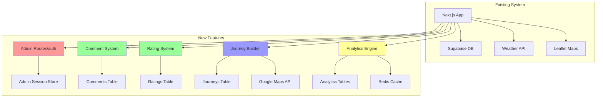

# 2. SYSTEM ARCHITECTURE OVERVIEW

## 2.1 High-Level Architecture Extension

```mermaid
graph TD
    subgraph "Existing System"
        A[Next.js App] --> B[Supabase DB]
        A --> C[Weather API]
        A --> D[Leaflet Maps]
    end
    
    subgraph "New Features"
        A --> E[Admin Routes/auth]
        E --> F[Admin Session Store]
        
        A --> G[Comment System]
        G --> H[Comments Table]
        
        A --> I[Rating System]
        I --> J[Ratings Table]
        
        A --> K[Journey Builder]
        K --> L[Journeys Table]
        K --> M[Google Maps API]
        
        A --> N[Analytics Engine]
        N --> O[Analytics Tables]
        N --> P[Redis Cache]
    end
    
    style E fill:#ff9999
    style G fill:#99ff99
    style I fill:#99ff99
    style K fill:#9999ff
    style N fill:#ffff99
```

---
