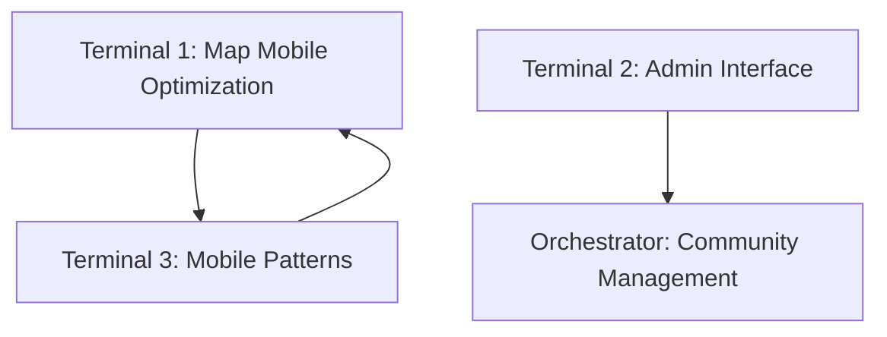

# Orchestrator Dashboard

## Current Status Overview

### Epic 1 Foundation (✅ COMPLETE)
- **Infrastructure**: Next.js 14, Supabase, deployment pipeline
- **Core Features**: Place database (100+ locations), basic map, homepage, navigation
- **Partial Features**: Weather API (backend only), Community questions (frontend only)
- **Testing**: Basic testing setup (E2E/CI-CD deferred)

### Epic 1 Deferred Items Distribution
| Deferred Item | Assigned Terminal | Priority | Impact |
|---------------|-------------------|----------|---------|
| Weather UI Integration | Terminal 1 | HIGH | Enables Terminal 3 analytics |
| E2E Testing + CI/CD | Terminal 1 | MEDIUM | Project-wide quality |
| Admin Interface | Terminal 2 | HIGH | Manage existing questions |  
| Email Notifications | Terminal 2 | MEDIUM | Community engagement |
| FAQ System | Terminal 2 | LOW | User self-service |

## Terminal Status Monitoring

### Terminal 1: Enhanced Experience & Intelligence
**Status**: 🟡 In Progress  
**Team**: Full-stack Dev + QA Specialist + Testing Engineer  
**Epic 1 Deferred**: Weather UI, E2E testing, CI/CD pipeline  
**Epic 2+ Stories**: 2.1 (Enhanced Map), 2.4 (Enhanced Search), 4.1 (Weather Recommendations)

**Critical Dependencies**:
- ✅ Epic 1 weather API backend (complete)
- ✅ Epic 1 map foundation (complete)

**Coordination Outputs**:
- Map components for Terminal 3 mobile optimization
- Search APIs for Terminal 3 content discovery
- Testing infrastructure for all terminals

**⚠️ Watch Points**:
- Weather UI completion needed for Terminal 3 analytics
- E2E testing setup affects project deployment

### Terminal 2: Community & Social Platform  
**Status**: 🟡 In Progress  
**Team**: Backend Dev + Frontend Dev + Community QA  
**Epic 1 Deferred**: Admin interface, email notifications, FAQ system  
**Epic 3+ Stories**: All community features (3.1-3.5)

**Critical Dependencies**:
- ✅ Epic 1 community question foundation (complete)

**Coordination Outputs**:
- Community APIs for user-generated content
- Social sharing components for other terminals
- Admin interfaces for content management

**⚠️ Watch Points**:
- Admin interface needed immediately for managing existing questions
- Email system affects user engagement

### Terminal 3: Content & Business Intelligence
**Status**: 🟡 In Progress  
**Team**: Content Dev + Business Dev + Analytics QA  
**Epic 1 Deferred**: None  
**Epic 2+ Stories**: 2.2, 2.3, 2.5, 4.2, 4.3, 4.5

**Critical Dependencies**:
- ✅ Epic 1 place database (complete)
- ✅ Epic 1 content structure (complete)
- ⏳ Terminal 1 weather UI (for analytics context)

**Coordination Outputs**:
- Rich content APIs for other terminals
- Mobile optimization patterns for Terminal 1
- Analytics data for coordination decisions

**⚠️ Watch Points**:
- Mobile patterns needed early for Terminal 1 map optimization
- Content APIs needed for Terminal 2 social sharing

## Integration Checkpoints

### Week 1 Critical Path


### API Contract Status
- **Enhanced Map APIs**: Terminal 1 → Terminal 3 ⏳
- **Community APIs**: Terminal 2 → Terminal 3 ⏳  
- **Content APIs**: Terminal 3 → Terminal 1,2 ⏳
- **Search APIs**: Terminal 1 → Terminal 2,3 ⏳

### Performance Baseline
- **Target Load Time**: < 2s first contentful paint
- **Mobile Performance**: > 90 Lighthouse score
- **API Response**: < 200ms average
- **Test Coverage**: > 80% critical paths

## Coordination Commands

### Monitor All Terminals
```bash
npm run coordinate:status
```

### Check Integration Readiness  
```bash
npm run coordinate:check
```

### Validate API Contracts
```bash
npm run coordinate:validate
```

### Run Integration Tests
```bash
npm run coordinate:integrate
```

### Terminal-Specific Testing
```bash
npm run test:terminal:enhanced-experience
npm run test:terminal:community-social  
npm run test:terminal:content-business
```

## Decision Points & Escalation

### RED FLAGS 🚨
1. **Terminal 1** delays weather UI > 3 days → Terminal 3 blocked
2. **Terminal 2** skips admin interface → Community management blocked
3. **Terminal 3** delays mobile patterns → Terminal 1 map blocked
4. **Any terminal** makes breaking API changes without contracts update

### DECISION MATRIX
| Scenario | Impact | Decision | Alternative |
|----------|--------|----------|-------------|
| Weather UI delayed | Terminal 3 analytics incomplete | Proceed with basic analytics | Manual weather context |
| Admin interface delayed | Cannot manage community | Manual email management | Temporary admin tools |
| Mobile patterns delayed | Map not mobile-optimized | Desktop-first approach | Progressive enhancement |
| API conflicts | Integration failure | Prioritize by user impact | Versioned APIs |

## Success Metrics

### Daily Targets
- ✅ All terminals update collaboration docs
- ✅ No blocking API contract conflicts
- ✅ Epic 1 deferred items show progress

### Weekly Targets  
- ✅ First integration checkpoint passes
- ✅ Cross-terminal testing validates
- ✅ Performance baseline maintained

### Final Integration Criteria
- ✅ All Epic 1 deferred items complete
- ✅ All assigned stories complete
- ✅ Cross-terminal integration validated
- ✅ Performance targets met
- ✅ Production deployment ready

## Communication Protocols

### Daily Sync (9:00 AM)
- Terminal status updates
- Blocker identification  
- API contract changes
- Integration readiness

### Weekly Strategic Review
- Progress against plan
- Risk assessment
- Resource reallocation
- Next week priorities

### Immediate Escalation
- Blocking dependencies
- Breaking changes
- Resource conflicts
- Timeline risks